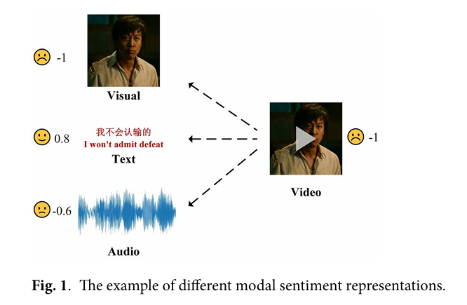
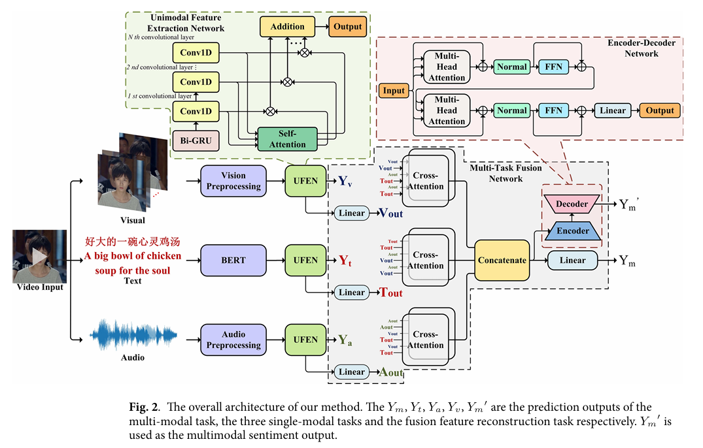
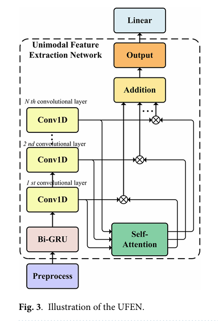
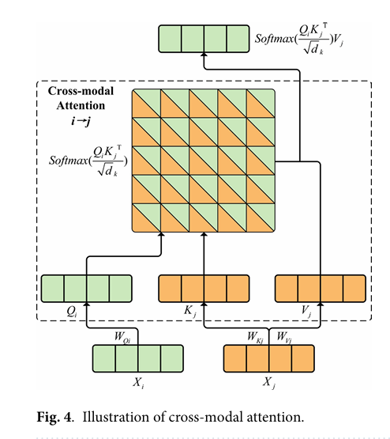
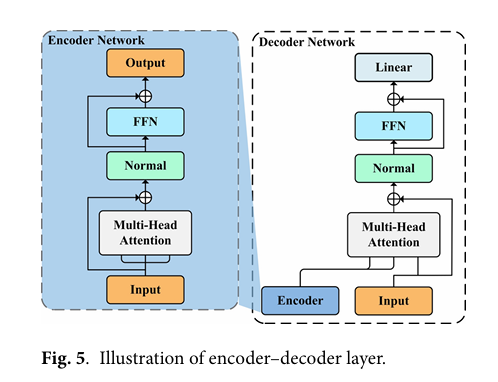
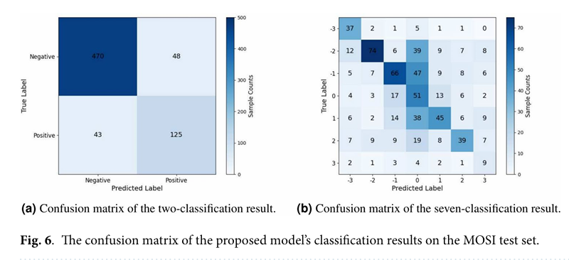
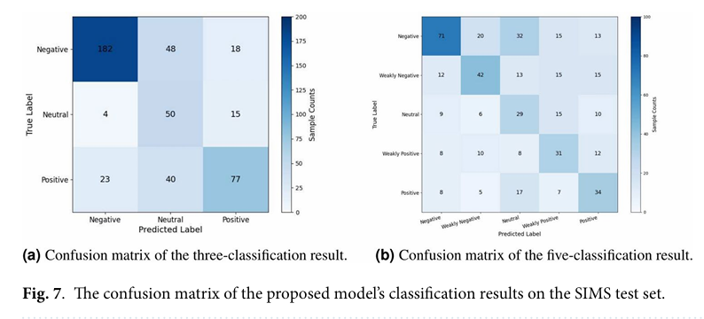
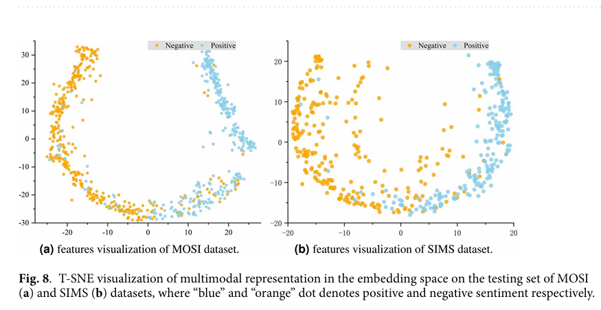
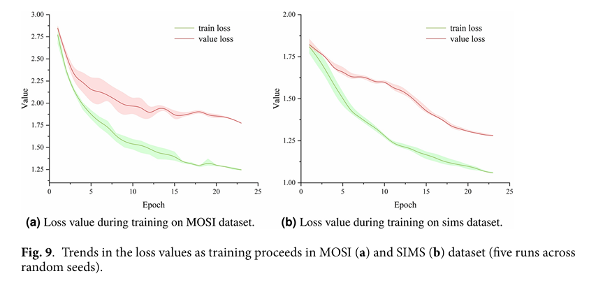
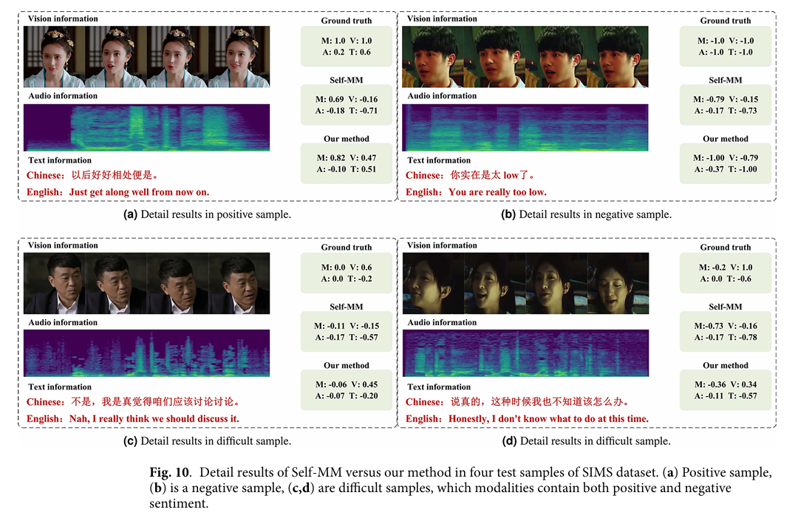

## Page 1

# Multimodal sentiment analysis based on multi-layer feature fusion and multi-task learning

Yujian Cai¹,², Xingguang Li¹,²✉, Yingyu Zhang¹, Jinsong Li¹, Fazheng Zhu¹ & Lin Rao¹

Multimodal sentiment analysis (MSA) aims to use a variety of sensors to obtain and process information to predict the intensity and polarity of human emotions. The main challenges faced by current multi-modal sentiment analysis include: how the model extracts emotional information in a single modality and realizes the complementary transmission of multimodal information; how to output relatively stable predictions even when the sentiment embodied in a single modality is inconsistent with the multi-modal label; how can the model ensure high accuracy when a single modal information is incomplete or the feature extraction performance not good. Traditional methods do not take into account the interaction of unimodal contextual information and multi-modal information. They also ignore the independence and correlation of different modalities, which perform poorly when multimodal sentiment representations are asymmetric. To address these issues, this paper first proposes unimodal feature extraction network (UFEN) to extract unimodal features with stronger representation capabilities; then introduces multi-task fusion network (MTFN) to improve the correlation and fusion effect between multiple modalities. Multilayer feature extraction, attention mechanisms and Transformer are used in the model to mine potential relationships between features. Experimental results on MOSI, MOSEI and SIMS datasets show that the proposed method achieves better performance on multimodal sentiment analysis tasks compared with state-of-the-art baselines.

Multimodal sentiment analysis (MSA) has promoted the development of Human-Computer Interaction (HCI), education and medical care, public opinion analysis, point of interest recommendation¹ and other fields. Human sentiment has many forms of expression, such as text, facial expressions, speech, behavior, physiological signals, etc. Each type of information can be used as a modality for sentiment analysis. MSA aims to combine some modalities containing human sentiment information to achieve a more comprehensive and accurate perception. Since each modality has unique characteristics, fusing multiple modalities can making full use of the complementary and transfer characteristics of information. However, multimodal information also has heterogeneity. The semantics between different modal data are not completely consistent, as shown in Fig. 1. Simple modal addition cannot achieve the expected effect. This puts higher requirements on the feature extraction and fusion network of multimodal sentiment analysis.

MSA mainly includes two processes, Intra modal feature extraction and inter-modal information interaction. Intra modal feature extraction is to obtain a higher-dimensional sentiment representation, which focuses on the spatial or temporal information in a single modality. Features within a modality are the basis for improving the complementary characteristics of information between multiple modalities. Inter-modal information interaction focuses on the fusion of information. It makes full use of the transmission and complementary characteristics of information to provide more accurate and robust results for sentiment analysis tasks. These fusion methods are divided into various types according to the fusion method, including: data fusion, feature fusion, decision fusion, etc². Combining the above two processes, the model can learn the characteristics of the corresponding modalities and the interactions between different modalities.

Common methods for intra-modal feature extraction include recurrent neural networks such as LSTM and GRU. These methods can effectively capture sequence features. However, they cannot balance the relationship between intra-modal and inter-modal interactions, which results in that RNN alone cannot capture the multi-scale information expected for inter-modal interactions. The Tensor Fusion Network (TFN) proposed by Zedeh et al.³ uses LSTM to extract intra-modal feature information. And a triple Cartesian product is introduced to build a tensor fusion layer to simulate the dynamic fusion between different modal, although the computational complexity is high. Wang et al.⁴ combined GRU and Transformer to mine the intra-modal interactions, and

¹School of Electronic Information Engineering, Changchun University of Science and Technology, Changchun JL431, China. ²Jilin Province Medical Intelligent Technology and Equipment Joint Technology Innovation Laboratory, Changchun JL431, China. ✉email: lixingguang@cust.edu.cn

---

Scientific Reports | (2025) 15:2126 | https://doi.org/10.1038/s41598-025-85859-6 | nature portfolio

---

## Page 2

www.nature.com/scientificreports/

**Fig. 1.** The example of different modal sentiment representations.

> **Description:** A video clip of a person is decomposed into three independent modality streams, each assigned an independent sentiment score by a unimodal model: **Visual** (facial expression) → −1, **Text** ("I won't admit defeat") → +0.8, **Audio** (speech waveform) → −0.6. The fused multimodal representation yields an overall score of −1. This example illustrates the core challenge of modal *heterogeneity*: the textual content expresses a positive, defiant sentiment, while the facial expression and voice tone are negative, making simple modal averaging unreliable and motivating the need for a principled fusion strategy.

integrated information into coding features to improve the correlation between modalities. For the inter-modal information interaction process, inspired by the attention mechanism, many models use attention-based strategies to fuse multi-modal features. Tsai et al.⁵ proposed Multimodal Transformer (MulT), which uses a multi-head attention mechanism to focus on features of different modalities and time series. The model can also produce stable predictions on unaligned data. However, it uses many fusion features for sentiment analysis but ignores the intra-modal features, which may lead to insufficient utilization of certain modal information. Sun et al.⁶ use the sentiment representation between modalities as context and interact with intra-modal features. This method better balances the relationship between intra-modal and inter-modal information interaction. Although numerous studies have proposed novel approaches for multimodal feature extraction and fusion, there is a lack of research focusing on precise sentiment analysis under conditions of modal imbalance and implicit expression, which are more prevalent in real-world scenarios.

Based on the above analysis, the main research motivation of this paper and the problem it aims to address are as follows: (1) Many intra-modal features cannot be fully extracted, directly fusion may easily ignore this unique information. (2) The complementarity of inter-modal features is not fully utilized, and the prediction results are more likely to be biased towards the semantic information represented by one modality. (3) In a complex semantic environment, the emotional tendencies of each modality are inconsistent, and it is difficult for the model to balance the relationship between intra-modal and inter-modal.

In this paper, we propose a Unimodal Feature Extraction Network (UFEN) to capture contextual information within a single modality. It combines multi-layer information fusion and self-attention mechanism based on the convolution process to obtain more important and unique features of intra-modal. It also reduces the impact of redundant information on subsequent inter-modal feature fusion. In the process of inter-modal information interaction, multi-head attention module can help the model learn more complementary information and high-dimensional representations between features. Based on this, we proposed a Multi-Task Fusion Network (MTFN), which is applied to the extraction of potential relationships between modalities and the overall sentiment representation of the fused features. This network introduces cross-modal attention module, Encoder and Decoder layer. In order to alleviate the problem of inconsistent sentiment representations in multiple modalities that reduce the accuracy of predictions, we set multi-modal sentiment analysis to multi-task learning. The feature representations of multiple tasks jointly affect the model, and the loss of each task is used to balance the relationship between intra-modal and inter-modal information interaction.

The main research objectives and contributions of this paper can be summarized as follows:

*   Optimize and improve the quality and representational capacity of unimodal feature extraction: We propose a UFEN to extract single-modal semantic representation. This network is based on multi-layer information fusion, combining convolutional layers and self-attention modules. The network focuses on more representative information through time series features and different scale features;
*   Maintain accurate information interaction and result prediction under conditions of sentiment asymmetry or implicit expression: We propose an MTFN, which treats MSA as a multi-task learning. This model can extract complementary features between modalities while alleviating the impact of asymmetry in inter-modal sentiment representation;
*   The model can be applied to various sentiment analysis tasks and exhibits good generalization ability: To verify the effectiveness of the proposed method, we conduct comprehensive experiments on three widely used MSA benchmark datasets, including CMU-MOSI, CMU-MOSEI and CH-SIMS. The experimental results show that our method outperforms previous methods. The rest of this paper is structured as follows: “Related works” section introduces related work in recent years. In “Methods” section, we define the problem formulation and introduce the details of the method proposed in this paper. “Experiments” section describes the experimental dataset, evaluation metrics, experimental configurations and baseline models. “Results” section describes the experimental result analysis, ablation experiments and visualization analysis. Lastly, we draw our conclusions in “Conclusion” section.

---

## Page 3

Related works

In this section, we briefly review related work on multimodal sentiment analysis and multitask learning. In addition, we introduce how our work differs from previous work.

Multimodal sentiment analysis

Early sentiment analysis methods were unimodal and mainly focused on text modality. Text data alone cannot meet the demand for accurate analysis of more complex emotions in HCI. Therefore, multimodal emotion analysis had been proposed. In addition to text modality, multimodal sentiment analysis also includes speech and visual information, which can be used to predict implicit sentiment polarity more accurately. Research on multimodal sentiment analysis mainly focuses on representation learning and multimodal fusion. For multi-modal representation learning, Hazarika et al. designed two different encoders to project features into modality-invariant subspaces and modality-specific subspaces respectively. Fang et al. proposed a multi-modal similarity calculation network to learn embedding representations between text and images in a unified vector space. Zhang et al. proposed an adversarial network to reduce the transfer of expression style in multi-modal cross-domain sentiment analysis and obtain joint representation between modalities. This approach facilitates the transfer of emotional information between different domains. Sun et al. proposed modality-invariant temporal learning techniques and inter-modal attention to obtain intra-modal and inter-modal features.

For multi-modal fusion, it can be mainly divided into early fusion and late fusion. Early fusion usually refers to concatenating features from different modalities as input, while late fusion builds independent models for each modality and then integrates the output. Zadeh et al. fused multimodal features by external product of vectors. Yang et al. introduced attention to capture the representational relationships between different modalities before feature fusion. Zeng et al. used graph neural networks to fuse multi-source features and balance independent and complementary information between modalities. Li et al. used quantum theory to model the interaction between intra-modal and inter-modal, and used superposition and entanglement expressions at different stages. Majumder et al. adopt a hierarchical approach to fuse modal, first fusing unimodal, and then fusing all modal.

In addition, sentiment analysis research based on physiological signals such as electroencephalogram, electrocardiogram, and electrodermal activity signal are also popular. Kumar et al. used EEG and product review signals to perform sentiment analysis and obtain multi-modal ratings of consumer products. Katada et al. combined electrodermal activity signal with linguistic representations to improve the effect of multi-modal sentiment analysis. At the same time, they used multiple unimodal models to prove that different physiological signals play different roles in sentiment analysis.

Deep learning method

Since deep learning inception, its methods have dominated the research in many directions. The field of affective computing, like other areas of computing research, has benefited greatly from advances in deep learning.

Daneshfar et al. explored the problem of model instability caused by different cultural and language differences. They used a transfer learning method based on training enhancement to achieve accurate cross-language sentiment analysis and achieved excellent results on the German sentiment analysis dataset. Zhang et al. addressed the issue of limited labeled speech data by using semi-supervised learning to generate pseudo-labels. They employed a knowledge transfer method to integrate cross-modal knowledge from image data into the learning process, achieving relatively accurate speech emotion analysis. Li et al. aimed to address the issue of performance degradation in MSA caused by uncertain modality missing in practical applications. They proposed a related decoupled knowledge extraction method and used distillation learning algorithm to reconstruct the missing semantic information. The model achieved good results on the MOSI dataset. Meena et al. applied the RNN method to develop a Point of Interest (POI) recommendation system. They achieved accurate sentiment analysis for multiple tasks including travel suggestions and group recommendations by integrating the SA model and the POI model. Paskaleva et al. conducted research on interpretable emotion representation and expression generation, they developed a method that leverages labels of the non-unified models to annotate the novel unified one, and then used a diffusion model to generate images with a rich expression and additional attributes described by the conditioning text input.

Although deep learning methods have brought about huge performance improvements, there are still many aspects that need to be improved before meeting the growing expectations of users. The first is the interpretability of the model. Now more and more researchers are conducting research on this issue. Giving the model a complete physical meaning can make it easier to improve the model. The second is the model's ability to generalize outside the domain. Under the study of limited data, stronger generalization ability will enable the model to achieve better prediction results on different tasks and be closer to people's real needs for algorithms.

Multi-task learning

Multi-task learning aims to utilize the useful information contained in multiple related tasks to help improve the generalization performance of the model. Compared with single-task models, multi-task learning has three advantages: (1) By sharing information, the performance of the model can be improved; (2) It has better generalization ability; (3) Only one overall model is required, which reduces the model complexity. Multi-task learning has been widely used in MSA because of these advantages. Multi-task networks use parameter sharing methods to achieve the overall optimization of the model, which can be divided into hard parameter sharing and soft parameter sharing. Hard parameter sharing means that multiple tasks share several hidden layers of the network and make predictions for different tasks before output. Soft parameter sharing refers to using independent models for different tasks, as while as sharing and optimizing parameters between models.

---

## Page 4

Based on the interdependence of the two subtasks, Akhtar et al. proposed a GRU-based multimodal attention framework for simultaneously predicting the sentiment and expressed emotions of an utterance. Foggia et al. used multi-task convolutional neural networks to recognize gender, age, race and emotion from face images. At the same time, a weighted loss function is used to solve problems such as dataset imbalance and label loss. He et al. proposed an interactive multi-task learning network that can perform joint learning of multiple related tasks at the token level and document level. The model utilizes a message passing architecture based on hard parameter sharing to pass shared latent variables to different tasks. Bai et al. proposed a multi-task extraction descent framework that iteratively optimizes a single cost function for each task through improved gradient descent. This method further improves the generalization performance of multi-task learning. Singh et al. introduced multi-task learning into complaint recognition and sentiment analysis, using deep neural networks and enhanced models based on common sense knowledge to obtain higher accuracy. Wang et al. proposed a hierarchical multi-task learning framework for the end-to-end sentiment analysis task of simultaneously detecting aspect terms and sentiments, which utilizes the supervision of intermediate layers to fuse task-related features. Zhang et al. proposed a broad transformer network, which uses features and fine-tuning methods to obtain high-level information of contextual representation.

In summary, previous methods tend to use fixed strategies to fuse the features of different modalities, without taking into account the differences between dimensions and modalities. The proposed multi-modal sentiment analysis model based on UFEN and MTFN can better mine the independent and complementary feature between intra-modal and inter-modal. Combining multi-layer information fusion with multi-task learning can improve the performance of sentiment analysis.

**Methods**

In this section, we describe the proposed method in detail. We first define the multimodal sentiment analysis task of this paper and explain the corresponding notation of the problem. Then we introduce the overall model of this article, including UFEN and MTFN. In addition, we also introduce the Transformer module we used. Finally, the multi-task learning method and overall optimization goal of the model is given.

**Task definition**

The MSA task in this paper refers to predicting the polarity and intensity of sentiment through video information. MSA task usually contains three main modalities: text (T), audio (A) and visual (V). We define the input of the model as $X_i \in \mathbb{R}^{(T_i \times D_i)}$, where $T_i$ is sequence length and $D_i$ denotes the feature dimension of modal $i$. Specifically, $i \in \{t, a, v\}$. The proposed model extracts the feature information of intra-modal through UFEN. Then MTFN is used for feature complementary fusion and multi-task learning. The output result of the UFEN is defined as $Y_i$, and the output of the MTFN is defined as $Y_m$ and $Y_m'$. We take $Y_m'$ as the final prediction result of the model in the multimodal sentiment analysis task, and use $Y_i$ and $Y_m$ to balance the information interaction of each task. The true label of data is defined as $Y$.

**Model framework**

The data used for multi-modal sentiment analysis can include easy-to-obtain external signals such as facial expressions, audio and text. It can also include physiological signals such as ECG, EEG, EMG and HR that are difficult to obtain but are more representative of real sentiment. The signals of these modalities have common characteristics that can reflect sentiment, as well as characteristics unique to a single modality. Utilizing the complementary characteristics of signals between different modalities can achieve more effective multi-modal sentiment analysis compared to single-modal sentiment analysis. Multimodal sentiment analysis has broader application prospects and meets people's needs for future HCI. In order to better balance the relationship between intra-modal feature extraction and inter-modal feature fusion, this paper proposes a model based on multi-layer feature fusion and multi-task learning, as shown in Fig. 2.

Firstly, we introduce a UFEN to extract intra-modal feature information and mine the interrelationships between multi-scale features. Assigns more weight to features that can express sentiment and reduces the adverse impact of redundant information on subsequent multi-modal feature fusion. Since multimodal sentiment analysis fuses multiple types of information and they contain different features for sentiment analysis, it is necessary to consider the hidden connections between different sensor data and assign different weights to these tasks. Based on this, in the second step, we construct an MTFN to strengthen information interaction between intra-model and inter-model. This network introduces cross-modal attention to combine representation information of different modalities. After connecting high-level features, we further capture feature information through the Encoder-Decoder layer of Transformer. In addition, we also introduce the idea of multi-task learning into multi-modal sentiment analysis, so that the model can adjust the importance of the modality according to the results and optimize the model.

**Unimodal feature extraction network**

UFEN is a multi-layer feature fusion model based on convolutional neural networks and self-attention for extracting intra-modal information. For the processing of heterogeneous data in different modalities, it uses multi-layer convolutional neural networks to obtain feature information of different dimensions, and then inputs the obtained multi-scale information into the self-attention module to adjust the weights of different features. Adding Bi-GRU and Multi-layer feature fusion enables the model to obtain temporal features based on the contextual information of the data. By fusing this information, it helps to improve the model’s representation ability and comprehensive perception of global and local information. For intra-model feature extraction, UFEN can meet the feature extraction needs of different scale data by changing the number of convolution layers, which

---

## Page 5

www.nature.com/scientificreports/

**Fig. 2.** The overall architecture of our method. The $Y_m$, $Y_t$, $Y_a$, $Y_v$, $Y_m'$ are the prediction outputs of the multi-modal task, the three single-modal tasks and the fusion feature reconstruction task respectively. $Y_m'$ is used as the multimodal sentiment output.

> **Description:** The model is divided into two sequential stages:
>
> **Stage 1 — Unimodal Feature Extraction (UFEN, applied independently per modality):**
> - *Visual*: raw video frames → **Vision Preprocessing** → **UFEN** → $Y_v$ (visual unimodal representation); a parallel **Linear** branch produces $V_{out}$ (compressed visual features for fusion).
> - *Text*: raw text → **BERT** encoder → **UFEN** → $Y_t$; parallel **Linear** → $T_{out}$.
> - *Audio*: raw audio → **Audio Preprocessing** → **UFEN** → $Y_a$; parallel **Linear** → $A_{out}$. \
> Each UFEN also has a dedicated linear head that outputs a unimodal sentiment score ($Y_v$, $Y_t$, $Y_a$), used as unimodal subtask targets in multi-task learning.
>
> **Stage 2 — Multi-Task Fusion Network (MTFN):**
> Three **Cross-Attention** blocks, one per modality, each compute **two separate pairwise cross-attentions** against the other two modalities:
> - *Visual* block: $v \rightarrow t$ ($V_{out}$ as Q, $T_{out}$ as K/V) **and** $v \rightarrow a$ ($V_{out}$ as Q, $A_{out}$ as K/V).
> - *Text* block: $t \rightarrow a$ ($T_{out}$ as Q, $A_{out}$ as K/V) **and** $t \rightarrow v$ ($T_{out}$ as Q, $V_{out}$ as K/V).
> - *Audio* block: $a \rightarrow t$ ($A_{out}$ as Q, $T_{out}$ as K/V) **and** $a \rightarrow v$ ($A_{out}$ as Q, $V_{out}$ as K/V).
>
> This yields **6 cross-attention outputs** in total (all ordered pairs of the three modalities). These are concatenated to form $\text{Input} \in \mathbb{R}^{d_b \times 6d_m}$, which is then routed to two branches:
> 1. **Linear** applied to $\text{Input}$ → $Y_m$ (multimodal fusion task prediction).
> 2. **Encoder-Decoder Network** applied to $\text{Input}$ → $Y_m'$ (fusion feature reconstruction prediction, used as the **final sentiment output**).
>
> **Multi-task learning** jointly trains five output heads: $Y_m$, $Y_t$, $Y_a$, $Y_v$, and $Y_m'$, with a plain (unweighted) sum of their individual MSE losses as the total training objective: $\mathcal{L}_{total} = \sum_{i \in \{t, a, v\}} (\mathcal{L}_{gt}^i + \mathcal{L}_{gt}^f + \mathcal{L}_{gt}^{en\text{-}de})$.

can obtain more fine-grained features. UFEN has good generalization performance to adapt to the needs of different tasks, the structure of UFEN is shown in Fig. 3.

For different modality, we use different methods to preprocess and then input to UFEN. The input is defined as $X_i \in \mathbb{R}^{(T_i \times D_i)}$, where $i \in \{t, a, v\}$ is used to represent the current mode. Bi-GRU is used to obtain the temporal characteristics and contextual sentiment information of data. In order to make the model pay attention to global features and local features at the same time, we introduce convolution and self-attention for multi-layer feature fusion. Data preprocessing can be described as:

$$X_i = Perprocess(X_i) \in \mathbb{R}^{T_i \times D_i}$$

Based on the classic GRU network architecture, the Bi-GRU layer simultaneously extracts the hidden state between information in the forward and backward propagation processes. Bi-GRU can be expressed as:

$$\begin{cases}
\vec{h}_t = \overrightarrow{GRU}\left(X_t, \vec{h}_{t-1}\right) \\
\langle h_t = \overleftarrow{GRU}\left(X_t, \langle h_{t-1}\right) \\
h_t = \left[\vec{h}_t, \langle h_t\right]
\end{cases}$$

Where $X_t$ represents the input information of the current time step. $h_{t-1}$ is the GRU output of the previous time step. GRU includes the calculation of parameters such as reset gates, update gates, and hidden states. The forward hidden representation $\vec{h}_t$ and the backward hidden representation $\langle h_t$ are spliced to obtain $h_t$. The final output of Bi-GRU is expressed as $X_i^{Bi-GRU}$, which is in the low-dimensional space $\mathbb{R}^{d_m}$.

$$X_i^{Bi-GRU} = BiGRU(X_i)$$

After obtaining time series information, the model focuses on multi-dimensional information extraction and fusion. Therefore, multi-layer convolutional feature extraction process is introduced, which can be described as:

$$X_i^{layer} = Conv1D^{layer}(X_i^{Bi-GRU}, K, F)$$

Where $layer$ represents the number of one-dimensional convolution layers, $K$ is the kernel size of the convolution layer, and $F$ is the number of filters in the convolution layer. For $layer \in \{1, 2, \ldots, l\}$, $F \in \{F_1, F_2, \ldots, F_l\}$ and $X_i^{layer} \in \{X_i^1, X_i^2, \ldots, X_i^l\}$ represents the output of different number convolutional layers.

---

## Page 6

www.nature.com/scientificreports/

**Fig. 3.** Illustration of the UFEN.

> **Description:** The UFEN processes a single modality input through the following sequential and parallel pipeline:
>
> 1. **Preprocess**: Modality-specific normalization/padding of the input sequence $X_i \in \mathbb{R}^{T_i \times D_i}$.
> 2. **Bi-GRU**: A bidirectional GRU processes the sequence in both temporal directions, producing hidden states $H$ that encode local context and long-range dependencies. This output is the base for all subsequent layers.
> 3. **N parallel Conv1D branches** (labeled 1st, 2nd, …, Nth): Each Conv1D branch independently takes the **Bi-GRU output** $X_i^{Bi-GRU}$ as input (Eq. 4: $X_i^{layer} = \text{Conv1D}^{layer}(X_i^{Bi-GRU}, K, F)$), but with a different kernel size $K$ and filter count $F$, capturing temporal patterns at different scales in parallel.
> 4. **Self-Attention** (one shared module, applied per branch): For each Conv1D branch, the same self-attention module takes **that branch's output** $X_i^{layer}$ as input (Eq. 5: $X_i^{layerAtt} = \text{Attention}(X_i^{layer})$) and computes an attention weight map over it. The result is then **element-wise multiplied** with the Conv1D output to gate it: $X_i^{self\text{-}att} = X_i^{layer} \otimes X_i^{layerAtt}$. This gates each branch's features by its own global attention.
>    - After unpooling to align all branches to dimension $d_m$, each gated output is held for summation.
> 5. **Addition**: The attention-gated, upsampled outputs from all $N$ parallel Conv1D branches are summed element-wise ($\oplus$), yielding the multi-scale fused representation $X_i^{fusion} \in \mathbb{R}^{d_m}$.
> 6. **Output** ($X_i^{fusion}$): The summed representation is the unimodal feature vector passed to the MTFN for cross-modal fusion.
> 7. **Linear** (top): A separate linear classifier head on $X_i^{fusion}$ produces the unimodal subtask prediction score $Y_i$ (used for multi-task learning).
>
> The key design insight: all Conv1D branches start from the same Bi-GRU output but use different filters to extract different-scale temporal patterns in parallel. Each branch's self-attending gate selectively amplifies the most sentiment-relevant positions *within that branch's own feature space*. Summing all gated branches retains fine-grained local features from every scale simultaneously.

In order to reduce redundant information and integrate multi-level features, we combine convolution with attention weights. The attention mechanism is used to highlight the most relevant features from the unimodal feature extraction process, allowing the model to focus on both local and global contextual information. It can be described as:

$$\begin{cases} X_i^{layerAtt} = Attention \left( X_i^{layer} \right) \\ X_i^{self-att} = X_i^{layer} \otimes X_i^{layerAtt} \end{cases}$$

(5)

Where $Attention()$ represents attention calculation. When Q, K, and V are all in the same mode, it can be regarded as self-attention. The detailed process of the attention mechanism is shown in “Cross-modal attention”.

In order to ensure that the features enhanced by attention are aligned with the dimensions required for subsequent processing, an up-sampling operation is performed after the attention mechanism, can be described as:

$$X_{layer} = Unpooling \left( X_i^{self-att} \right) \in \mathbb{R}^{d_m}$$

(6)

Where $X_i^{fusion} \in \mathbb{R}^{d_m}$ is the output of UFEN. The up-sampled features of each layer are fused by matrix addition, which is expressed as:

$$X_i^{fusion} = X_1 \oplus X_2 \oplus \ldots \oplus X_{layer}$$

(7)

Where $\oplus$ stands for element addition. This method can not only retain the fine-grained information extracted by different convolutional layers, but also integrate the global dependency information captured by the attention mechanism.

In order to meet the needs of subsequent multi-task learning, we add a linear layer to implement single-modal sentiment analysis. The specific process is:

$$Y_i = softmax \left( W_i X_i^{fusion} + b_i \right)$$

(8)

Where $X_i^{fusion}$ is the hidden state, which is used for inter-modal feature fusion, $W_i$ is the weight matrix, and $b_i$ is the corresponding bias. $Y_i$ is a single-modal label, used for multi-task learning.

---

## Page 7

www.nature.com/scientificreports/

**Multi-task fusion network**

For heterogeneous data in sentiment analysis task, there are both low-level features that can represent specific information of a certain modality, and high-dimensional features with global semantic information of multiple modalities. It is difficult for the model to strike a balance between intra-modal feature extraction and inter-modal information fusion. In this case, using multi-task learning method to give higher weight to the dominant modal can improve the stability of the sentiment analysis results. In order to improve the effectiveness of multi-modal fusion, this paper designs an MTFN model to extract inter-modal features by exploring multi-task learning and information interaction between modalities. MTFN mainly consists of two parts: (1) Cross-modal multi-head attention (“Cross-modal attention”) used to fuse different modal features; (2) Encoder-Decoder layer (“Encoder–decoder layer”) used to enhance feature extraction and information representation of multi-task learning; (3) Multi-Task learning used to combat data imbalance and improve generalization performance (“Multi-task learning”).

**Cross-modal attention**

We adopt cross-modal multi-head attention to enhance information interaction between modalities. In addition, fuse global features and local features to obtain more representations. For modalities $i$ and $j$, we define modal $i$ as Query and calculate the mutual relationship between $i$ and $j$. The cross-modal attention from $i$ to $j$ can be expressed as $i \rightarrow j$, and the structure is as shown in Fig. 4.

First, we use linear to map intra-feature of modal $i$ and modal $j$, $X_i = W_i X_i + b_i$ and $X_j = W_j X_j + b_j$, where $W_i \in \mathbb{R}^{D_e \times D_i}$, $W_j \in \mathbb{R}^{D_e \times D_j}$. Then the modal $i$ in the two-dimensional space is defined as Query, and the modal $j$ is defined as Key and Value, and the specific process is as follows:

$$\begin{cases}
Q_i = W_{Q_i} X_i \\
K_j = W_{K_j} X_j \\
V_j = W_{V_j} X_j
\end{cases}$$

(9)

Where $Q_i \in \mathbb{R}^{D_e \times D_i}$ and $K_j, V_j \in \mathbb{R}^{D_e \times D_j}$. Cross-modal representation can be obtained by calculating the similarity between Query and Key, then weighted summation with Value.

$$CrossAtt(Q_i, K_j, V_j) = softmax\left(\frac{Q_i K_j^T}{\sqrt{d_k}}\right) V_j$$

(10)

Where $d_k$ is the set dimension of Query and Key. Different from single-head cross-modal representation, multi-head cross-modal attention uses different parameters to perform multiple linear projections on the Query, Key, and Value. It can represent the features of different subspaces cross-modally. Multiple features are concatenated and linearly projected again to obtain the final result. The specific process is as follows:

$$\begin{cases}
head_n = CrossAtt(Q_{i,n}, K_{j,n}, V_{j,n}) \\
MhAtt(Q_i, K_j, V_j) = Concat(head_1, \ldots, head_n) W
\end{cases}$$

(11)

Fig. 4. Illustration of cross-modal attention.

> **Description:** The figure illustrates the cross-modal attention operation from source modality $i$ to target modality $j$ (denoted $i \rightarrow j$). The computation proceeds as follows:
>
> 1. **Linear projections**: The source feature $X_i$ is projected via weight matrix $W_{Q_i}$ to produce the **Query** $Q_i$. The target feature $X_j$ is projected via $W_{K_j}$ and $W_{V_j}$ to produce the **Key** $K_j$ and **Value** $V_j$ respectively.
> 2. **Attention map**: The similarity between $Q_i$ and $K_j$ is computed and scaled: $\text{softmax}\!\left(\frac{Q_i K_j^\top}{\sqrt{d_k}}\right)$, producing an attention matrix of shape $(T_i \times T_j)$. Each row is a distribution over all time-steps of modality $j$, indicating how much each position in $j$ is relevant to a given position in $i$.
> 3. **Weighted aggregation**: The attention map is multiplied by $V_j$ to produce the final cross-modal output: $\text{softmax}\!\left(\frac{Q_i K_j^\top}{\sqrt{d_k}}\right) V_j$.
>
> The asymmetric design — modality $i$ providing Query while modality $j$ provides both Key and Value — means modality $i$ selectively pulls the most sentiment-relevant information from modality $j$ without modifying $j$'s representation. In the MTFN, this is extended to **multi-head** cross-modal attention, where several parallel attention heads operate in different subspaces and their outputs are concatenated and linearly projected.

---

## Page 8

www.nature.com/scientificreports/

Where $\text{head}$ is the cross-modal attention output in the subspace, $head_n \in \mathbb{R}^{\frac{D_e}{n}}$, $Q_{i,n} \in \mathbb{R}^{\frac{D_e \times D_i}{n}}$, $K_{j,n}, V_{j,n} \in \mathbb{R}^{\frac{D_e \times D_j}{n}}$ and $W \in \mathbb{R}^{D_e \times D_e}$. $MhAtt(\ )$ represents multi-head attention. After cross-modal multi-head attention processing, the output results are layer normalized to obtain the inter-modal features of i and j, expressed as:

$$\text{Output}_{CrossAtt} = LN(MhAtt(Q_i, K_j, V_j))$$

**Encoder-decoder layer**

After intra-modal and inter-modal feature extraction, the model can obtain multi-modal fusion features. In order to enhance the accuracy of the model in extracting sentiment features from multimodal data, we constructed an Encoder-Decoder layer, as shown in Fig. 5.

The higher-dimensional features of the fused modality are obtained through the encoder network, and then the decoder network is used to reconstruct the features. We incorporate the labels predicted by the encoder-decoder network and the labels predicted based on the fusion features into multi-task learning, which can improve the generalization performance of the model.

The Encoder-Decoder network contains three sub-network layers, including multi-head attention mechanism, layer normalization and feedforward network. Among them, the input of the multi-head attention layer in the decoder increases the output of the encoder.

First, the results $CA_{i \rightarrow i'}$ of cross-modal attention between different modalities are concatenated as the input of Encoder-Decoder. The specific process can be expressed as:

$$\text{Input} = Concat(CA_{i \rightarrow i'}) , \quad i \in t, a, v$$

Where $\text{Input} \in \mathbb{R}^{d_b \times 6d_m}$, $d_b$ is batchsize. $d_m$ is the single-modal feature dimension. For a given input, the first sub-layers of encoder and decoder are multi-head attention and layer normalization. The output of layer normal can be summarized as:

$$\begin{cases}
Nm_{en} = LN(Input + MhAtt(Input)) \\
Nm_{de} = LN(Input + MhAtt(Input, Output_{en}))
\end{cases}$$

Where $Nm$, $en$, $de$ represents normal, encoder and decoder. $MhAtt(\ )$ in the formula is introduced in “Cross-modal attention”. The output calculation process of decoder and encoder are:

$$\begin{cases}
\text{Output}_{en} = Nm_{en} + FF(Nm_{en}) \\
\text{Output}_{de} = Nm_{de} + FF(Nm_{de})
\end{cases}$$

Where $FF(\ )$ represents feed forward network. In addition, we add linear layers to the input and output signals of encoder-decoder for subsequent multi-task learning. The purpose of adding a linear layer after the decoder is to evaluate the reconstructed feature results and improve the generalization performance of the network. Introducing the predicted labels of reconstructed sentiment information into multi-task learning can optimize model parameters. This approach can also prevent the model from predicting high-dimensional information into a fixed label due to imbalance training or uneven sentiment representation of data. These two Linear layers can be expressed as:

$$\begin{cases}
Y_{m'} = \text{softmax}(W_{de} \text{Output}_{de} + b_{de}) \\
Y_m = \text{softmax}(W_m \text{Input} + b_m)
\end{cases}$$

Where $W_{de}$ and $W_m$ are weight matrices, $b_{de}$ and $b_m$ are the corresponding biases. $Y_{m'}$ and $Y_m$ represent the prediction labels.

Fig. 5. Illustration of encoder–decoder layer.

> **Description:** The figure shows the internal structure of the Encoder and Decoder networks side-by-side.
>
> **Encoder Network (left):**
> - **Input** (the concatenated cross-modal attention features) → **Multi-Head Attention** (self-attention: Q, K, V all from Input) → residual add ($\oplus$) with Input → **Layer Normalization (Normal)** → **Feed-Forward Network (FFN)** → residual add ($\oplus$) → **Output$_{en}$**.
> - The encoder thus produces a higher-dimensional, globally-attended representation of the fused multimodal features.
>
> **Decoder Network (right):**
> - **Input** → **Multi-Head Attention** (cross-attention: Q from Input, K and V from **Encoder Output**) → residual add ($\oplus$) with Input → **Layer Normalization (Normal)** → **Feed-Forward Network (FFN)** → residual add ($\oplus$) → **Linear** → **Output$_{de}$** ($Y_m'$).
> - The decoder uses the encoder's output as contextual guidance to reconstruct the fused feature representation, with a final linear layer that maps the decoded features to a sentiment prediction score.
>
> Both the encoder and decoder use residual (skip) connections around each sub-layer to ease gradient flow. $Y_m$ is produced by a separate linear head applied directly to **Input** (the concatenated cross-modal attention features, *before* the encoder): $Y_m = \text{softmax}(W_m \cdot \text{Input} + b_m)$. The encoder output itself does **not** produce $Y_m$. $Y_m'$ is produced from the decoder output: $Y_m' = \text{softmax}(W_{de} \cdot \text{Output}_{de} + b_{de})$, and is used as the final sentiment prediction.

---

## Page 9

Multi-task learning

Video, audio and text information are highly relevant to human sentiment representation. Common sentiment analysis methods include single-modal recognition for a certain type of information and multi-modal recognition for fused features. These methods have limitations in result accuracy and fine-grained sentiment feature extraction. Focusing only on a single task may ignore some related tasks that have potential information to improve model performance. Therefore, considering single-modality and fused-modality prediction as sub-tasks. By sharing representations, the complementary properties of multimodal sentiment representations can be better exploited. The generalization performance of the model will also improve. At the same time, the use of multi-task learning means that only one model is needed to handle the independent optimization and joint optimization of multiple modalities. Compared with the fusion of multiple models, multi-task learning can reduce the computational complexity of the model.

By combining the single-modal subtask, the multi-modal fusion feature subtask and the multi-modal feature reconstruction subtask, the total loss $ \mathcal{L}_{total} $ can be expressed as:

$$
\mathcal{L}_{total} = \sum_{i \in \{t, a, v\}} \left( \mathcal{L}_{gt}^i \right) + \mathcal{L}_{gt}^f + \mathcal{L}_{gt}^{en-de} 
$$  

(17)

Where $ \mathcal{L}_{gt}^i $ represents the loss between the single-modal prediction result $ Y_i $ and the ground truth $ Y $. $ \mathcal{L}_{gt}^f $ and $ \mathcal{L}_{gt}^{en-de} $ respectively represent the loss between multi-modal fusion prediction $ Y_m $, encoder-decoder layer prediction $ Y_m' $ and the ground truth $ Y $. All loss function calculations in the model use MSE (Mean Squared Error), which can be expressed as:

$$
\mathcal{L}_{gt}^x = \frac{1}{N} \sum_{n=1}^{N} (y^n - \hat{y}^n)^2
$$  

(18)

Where $ \mathcal{L}_{gt}^x $ represents the loss between the prediction results $ \hat{y}^n $ of different subtasks and the true value $ y^n $, and $ N $ is the number of training samples. The pseudocode for the entire training pipeline is illustrated in Algorithm 1.

**Input:** unimodal features $ X_i, i \in \{t, a, v\} $ with the corresponding ground truth labels $ Y $
**Output:** *model*

1. Initialize model parameters
2. **for** each sample in the mini-batch **do**
   1. UFEN (Uni-modal Feature Extraction Network)
      1. **for** each modality $ i \in \{t, a, v\} $ **do**
         1. Obtain the preprocessed input features $ X_i $ according to Eq.1
         2. Calculate the output $ X_i^{Bi-GRU} $ of Bi-GRU layer according to Eq.2 and Eq.3
         3. Extract multi-layer sentiment features $ X_i^{layer} $ according to Eq.4
         4. Calculate feature weights and up-sample features to the same size
         5. Extract multi-layer fusion features $ X_i^{fusion} $ according to Eq.5
         6. Obtain single-modal prediction result $ Y_i $ as in Eq.6
         7. Calculate the loss $ \mathcal{L}_{gt}^i $ between $ Y_i $ and ground truth $ Y $
      2. **end for**
   2. MTFN (Multi-Task Fusion Network)
      1. **for** each modality $ i \in \{t, a, v\} $ **do**
         1. Compute cross-modal representations $ CA_{i \rightarrow i'} $ between different modalities according to Eq.10
         2. Compute multi-modal fusion features $ CA_M $ according to Eq.11
         3. Obtain multi-modal prediction result $ Y_m $ as in Eq.14
         4. Calculate the loss $ \mathcal{L}_{gt}^f $ between $ Y_m $ and ground truth $ Y $
         5. Calculate the reconstruction features $ Output_{de} $ of the encoder-decoder layer according to Eq.13
         6. Obtain the prediction results $ Y_m' $ of encoder-decoder layer as in Eq.14
         7. Calculate the loss $ \mathcal{L}_{gt}^{en-de} $ between $ Y_m' $ and ground truth $ Y $
      2. **end for**
   3. Total Optimization
      1. Compute total training loss $ \mathcal{L}_{total} $ as in Eq.15
      2. Update model parameters
2. **end for**
3. **return** *model*

Algorithm 1. Training algorithm.

---

## Page 10

# Experiments

In this section, we introduce the datasets used in the experiment, detailed parameter settings, reference baselines and evaluation methods. The experiment involves three modalities: video, text, and audio.

## Dataset

**CH-SIMS**: The dataset CH-SIMS$^{35}$ contains 2281 carefully edited Chinese video clips from 60 film and television videos. The video clips have rich character backgrounds and a wide age range. The voice part of the video is in Mandarin, the length of the short clip is no less than 1 second and no more than 10 seconds. For each video clip, no other faces appear except the face of the speaker. The annotation of the dataset isolates information from other irrelevant modalities. The annotation order is text first, audio second, silent video third, and multimodal last. The annotation task includes 2 categories (Positive, Negative), 3 categories (Positive, Negative, Neutral) and 5 categories (Negative, weakly Negative, neutral, weakly positive, Positive). This dataset has accurate multimodal and independent unimodal annotations, which can be used to support researchers in multimodal or unimodal sentiment analysis.

**MOSI**: The Multimodal Corpus of Sentiment Intensity (MOSI)$^{36}$ dataset aims to highlight three characteristics: the diversity of viewpoint information, the importance of emotional intensity, and the complementarity between modalities. The author collected 2199 video clips through online sharing website, ranging in length from 2 to 5 min. The dataset contains video, speech, and text data. Each video clip is labeled with an intensity label of −3 (strongly negative) to 3 (strongly positive).

**MOSEI**: The Multimodal Opinion Sentiment and Emotion Intensity (MOSEI)$^{37}$ dataset is aimed at improving the diversity in the training samples, the variety in the topics and annotations of the current dataset. The authors collected 23,453 annotated video clips through online video sharing websites. The video clips come from 1000 different speakers and 250 topics. Each video segment contains manual transcription aligned with audio to phoneme level. The author also used a variety of methods to annotate the data, including a [−3, 3] Likert scale of: [−3 highly negative, −2 negative, −1 weakly negative, 0 neutral, +1 weakly positive, +2 positive, +3 highly positive] and a scale of [0 no evidence, 1 weak, 2 mid, 3 high] of Ekman emotions. The detailed statistics of SIMS, MOSI and MOSEI datasets are shown in Table 1.

## Experiments settings

In this article, our model training is based on NVIDIA GeForce RTX 3060Ti GPU and python3.9 + pytorch1.12.1 + cuda11.6 deep learning framework. In the experiment, we use the Adam optimizer to optimize the model parameters. For the MOSI, MOSEI and SIMS datasets we set three sets of hyperparameters, as shown in Table 2.

In order to make a fair comparison with other baselines, we follow the preprocessing method of the previous work $^{38–40}$ to extract features of images, audios and texts. For visual information, we use Facet $^{41}$ to extract facial expression features of MOSI and MOSEI datasets, and use Openface2.0 toolkit $^{42}$ to extract features of SIMS dataset. Facet first identifies the face in the video image frame and key landmarks on the face, such as eyebrows, the tip of nose, the corners of mouth. Then feature information including action units, facial landmarks and interocular distance. The action units contain 20 features. Openface2.0 toolkit is similar to Facet. It can also perform facial landmark detection, head pose estimation, facial action unit recognition and eye-gaze estimation, and the extracted features are spliced in sequence. For speech information, we use the Librosa $^{43}$ speech toolkit to extract the acoustic features of the SIMS dataset, and use the COVAREP $^{44}$ toolkit to extract the acoustic features of the MOSI and MOSEI datasets. Librosa is a commonly used Python package for audio signal processing. It is used to extract frame-level acoustic features of SIMS data at 22,050 Hz, with a total of 33 dimensions. Features include 1-dimensional logarithmic fundamental frequency (log F0), 20-dimensional Mel frequency cepstral coefficients (MFCCs) and 12 dimensional Constant-Q chromatogram (CQT), which are closely related to emotions and tone of speech. COVAREP software is similar to Librosa and is used to extract acoustic features related to emotion and intonation, including 12 Mel-frequency cepstral coefficients, pitch, voiced/unvoiced segmenting features, glottal source parameters, peak slope parameters and maxima dispersion quotients. For text modality, we adopt the BERT $^{45}$ pre-trained model as the feature extractor. BERT aims to learn word embeddings by pretraining deep bidirectional representations from unlabeled text, which jointly condition on both left and right contexts across all layers. Different BERT pre-training models are used for English and Chinese texts. Due to the characteristics of BERT, there is no need to use word segmentation tools before feature extraction. After preprocessing, all modal features are arranged in the order of shape[batch size, sequence length, feature dimensions].

## Baselines and experimental metrics

In order to verify the advantages of our method, we compare the performance of the proposed method with the MSA baselines. The details of these baselines are as follows:

- **EF-LSTM $^{46}$**: Early Fusion LSTM (EF-LSTM) utilizes feature-level fusion and sequence learning of Bidirectional Long-Short Term Memory (Bi-LSTM) deep neural networks.
- **LF-DNN $^{47}$**: Late fusion Deep Neural Network (LF-DNN) introduces three model structures to encode multi-modal data, and then combines PCA for early feature fusion and late decision fusion.
- **TFN $^3$**: Tensor Fusion Network (TFN) introduces an end-to-end fusion method for sentiment analysis. The tensor fusion layer explicitly models the unimodal, bimodal and trimodal interactions using a 3-fold Cartesian product from modality embeddings.
- **LMF $^{48}$**: Low-rank Multimodal Fusion (LMF) utilizes low-rank factors for multimodal representation and making multimodal feature fusion more efficient.
- **MulT $^5$**: Multimodal Transformer (MulT) utilizes a bidirectional cross-modal attention mechanism to focus on the interactions between multi-modal data at different time steps.

---

## Page 11

www.nature.com/scientificreports/

| Datasets | Train | Valid | Test | Total | Range of labels |
|----------|-------|-------|------|-------|-----------------|
| SIMS     | 1368  | 456   | 457  | 2281  | [-1, 1]         |
| MOSI     | 1284  | 229   | 686  | 2199  | [-3, 3]         |
| MOSEI    | 16326 | 1871  | 4659 | 22865 | [-3, 3]         |

**Table 1.** The detailed statistics of SIMS, MOSI and MOSEI datasets.

| Hyper-parameter | MOSI | MOSEI | SIMS |
|-----------------|------|-------|------|
| Learning rate   | 5e−3 | 1e−4  | 5e−3 |
| Batch size      | 32   | 32    | 16   |
| Self-Att head   | 1    | 1     | 1    |
| Cross-Att head  | 4    | 4     | 4    |
| Att dropout     | 0.2  | 0.2   | 0.2  |
| Dropout         | 0.1  | 0.1   | 0.1  |
| Early stop      | 8    | 8     | 8    |
| Epoch           | 30   | 50    | 50   |

**Table 2.** Model hyper-parameters.

MISA10: Modality-Invariant and Specific Representations(MISA) translates each modality into two different subspaces, learn commonalities and reduce modal gaps through modality-invariant subspaces, then capture private features through modality-specific subspaces.
Self-MM49: Self-Supervised Multi-task Multimodal (Self-MM) sentiment analysis network designs a label generation module based on the self-supervised learning strategy to acquire independent unimodal supervisions.
MFN50: Memory Fusion Network (MFN) proposes a Delta-Memory Attention Network (DMAN) to identify cross-view interactions while summarizing through Multi-view Gated Memory.
Graph-MFN37: This model introduces the Dynamic Fusion Graph (DFG) module based on the MFN network and performs fusion analysis.
MMIM51: Multimodal Mutual Information Maximization (MMIM) reduces task-related information loss by increasing the mutual information between unimodal representations, hybrid results and low-level unimodal representations.

In this article, we use two evaluation indicators, classification and regression, to evaluate the model. On MOSI and MOSEI, following previous works52–54, our evaluation indicators include binary accuracy (Acc-2), seven-class accuracy (Acc-7), F1-score, mean absolute error (MAE) and Pearson correlation coefficient (Corr). It is worth noting that Acc-2 have two different representation methods, namely negative/non-negative37 and negative/positive. Therefore, our results give two representations and use segmentation markers -/- to distinguish them, where the left score is negative/non-negative and the right score is negative/positive. On SIMS, following previous works35,55, our evaluation indicators include binary accuracy (Acc-2), triple accuracy (Acc-3), five-class accuracy (Acc-5), F1-score, MAE and Corr.

Acc-x is used to evaluate whether the model can divide the data into corresponding sentiment intervals, expressed as:

$$
Acc_x = \frac{1}{N} \sum_{n=1}^{N} I(\hat{y}^n \in I(y^n)) \tag{19}
$$

N represents the number of samples involved in model evaluation, $I()$ is an indicator function. When the model prediction value $\hat{y}^n$ is within the sentiment interval of ground truth, it outputs 1, otherwise 0. x represents the number of sentiment classifications. As x increases, there are more sentiment intervals $I()$, and the sentiment analysis becomes more detailed. Acc_x can also be calculated through the confusion matrix, which is expressed as:

$$
Acc_x = \frac{TP + TN}{TP + TN + FP + FN} \tag{20}
$$

F1-score is used to evaluate the performance of the model under data imbalance conditions. It combines precision Pc and recall Rc, can be expressed as:

$$
\begin{cases}
  F1score = 2 \times \frac{Pc \cdot Rc}{Pc + Rc} \\
  Pc = \frac{TP}{TP + FP} \\
  Rc = \frac{TP}{TP + FN}
\end{cases} \tag{21}
$$

---

## Page 12

MAE is used to measure the accuracy of model regression and is expressed as:

$$ MAE = \frac{1}{N} \sum_{n=1}^{N} |y^n - \hat{y}^n| $$

(22)

$y^n$ and $\hat{y}^n$ represent the true label of data and the predicted label of the model respectively. For all metrics except MAE, higher values indicate better performance. For all metrics except MAE, higher values indicate better performance.

## Results

In this section, we compare the proposed model with baselines on SIMS, MOSI and MOSEI datasets. We conduct ablation experiments and visual analysis simultaneously to demonstrate the effectiveness of the proposed method.

### Comparisons to baselines

In this subsection, we compare the proposed model with baselines for multimodal sentiment analysis. We perform model evaluation on the English dataset CMU-MOSI, CMU-MOSEI and the Chinese dataset CH-SIMS. The experimental results are shown in Tables 3, 4 and 5.

For the CMU-MOSI dataset, we can see the results from Table 3. Self-supervised learning-based self-MM and modal feature projection-based MISA outperform other baseline methods. However, our method based on multi-layer feature fusion and multi-task learning outperforms MISA and Self-MM on multiple evaluation metrics. Specifically, our method outperforms Self-mm by 2.7%/2.8% and outperforms MISA by 3.4%/3.2% on Acc2. The method is 2.7%/2.8%, 0.03, and 0.013 better than Self-mm in F1-score, MAE, and Correlation in bipolar sentiment analysis. At the same time, it is 3.5%/3.1%, 0.055, and 0.031 better than MISA. For Acc7, the method is 1.8% and 4.4% higher than Self-mm and MISA.

In order to better evaluate the performance of the model on MOSI dataset, we visualized the results of the two-class and seven-class classification of sentiment polarity. The confusion matrix is shown in Fig. 6. For the classification of two polarities, our method maintains a high classification accuracy. For the classification of seven sentiment polarities, our method performs better on test samples with obvious sentiment polarity. For weak sentiment polarity samples, although the classification results outperform baseline models, there is still risk of misclassifying them as neutral. This situation is more obvious in weak negative samples. We conclude that this may be due to the limited number of features that express weak emotions. When the sentiment features of each modality are inconsistent, the model is more inclined to neutral prediction results.

For the CMU-MOSEI dataset, we can see the results from the Table 4. Due to the increase in data volume and sentiment information, the performance of all baselines for multipolar sentiment analysis has improved. MMIM based on mutual information maximization and MISA based on modal feature projection outperform other baseline methods. Compared with the experimental results of all baselines on the MOSEI dataset, our method has improved to varying degrees. Specifically, our method outperforms MMIM by 2.7%/2.2% and outperforms MISA by 1.2%/0.5% on Acc2. The method is 2.6%/2.2%, 0.064 and 0.02 better than MMIM in F1-score, MAE and Correlation in bipolar sentiment analysis. At the same time, it is 1.1%/0.5%, 0.02, and 0.004 better than MISA. For Acc7, the method is 2.6% and 2.3% higher compared to MMIM and MISA. Our method has better performance on complex tasks.

For the CH-SIMS dataset, our method improves on most evaluation indicators, as shown in Table 5. It is 1.91% higher than Graph-MFN based on Dynamic Fusion Graph and MulT based on cross-modal attention on Acc2. It is 0.87 and 0.61 higher than Graph-MFN and tensor fusion-based TFN on F1-score. The model is close to the best-performing LF-DNN on MAE, with a difference of 0.004. And on Correlation, it is 0.012 different from Self-mm. The model improves both Acc3 and Acc5, with the highest improvements reaching 16.35% and 24.41%. The smallest improvements are 0.37% and 1.66%.

Judging from the experimental results of the three datasets, MFN performs poorly on CMU-MSOI and MOSEI, especially on Acc2, F1-score and Correlation. The reason may be that although MFN takes into account the intra-modal and inter-modal correlation of features, only using LSTM may not be able to fully extract the sentiment information in the data. At the same time, using all single-modal information for feature fusion will also lead to a reduction in SNR. EF-LSTM has the worst performance on the CH-SIMS dataset, mainly reflected in Acc2, F1-Score and Correlation. This may be due to the fact that early fusion is more used for coarse-grained feature extraction and the fused features are strongly affected by noise of each modality. This makes it difficult for fused features to accurately represent the connections between modalities.

In order to better evaluate the performance of the model on SIMS dataset, we visualized the results of the three-class and five-class classification of sentiment polarity. The confusion matrix is shown in Fig. 7. For the classification of three polarities, our method maintains a high classification accuracy. For the classification of five sentiment polarities, the results are similar to MOSI, the model has a chance of misclassifying other sentiment polarities as neutral, but its performance is better than that of MOSI. We conclude that this may be due to the SIMS dataset has more sentiment features.

To evaluate the novelty of our method in multimodal sentiment analysis research, we collected recent works from other research areas for comparison. The results are shown in Table 6.

As shown in the table, the method proposed in this paper has also gained attention from researchers in other fields and has demonstrated good performance across various tasks.

---

## Page 13

www.nature.com/scientificreports/

| Models       | MOSI |       |       |       |       |
|--------------|------|-------|-------|-------|-------|
|              | Acc2 | F1-score | MAE | Corr | Acc7 |
| EF-LSTMa | 77.8/79.0 | 77.7/78.9 | 0.952 | 0.651 | 34.5 |
| LF-DNNa | 78.0/79.3 | 77.9/79.3 | 0.978 | 0.658 | 33.6 |
| TFNb | -/80.8 | -/80.7 | 0.901 | 0.698 | 32.1 |
| LMFb | -/82.5 | -/82.4 | 0.917 | 0.695 | 32.8 |
| MFNb | 77.4/- | 77.3/- | 0.965 | 0.632 | 34.1 |
| Graph-MFNa | 77.9/80.2 | 77.8/80.1 | 0.939 | 0.656 | 34.4 |
| MulTb | 81.5/84.1 | 80.6/83.9 | 0.861 | 0.711 | 40.0 |
| MISAb | 81.8/83.4 | 81.7/83.6 | 0.783 | 0.761 | 42.3 |
| Self-MM* | 82.5/83.8 | 82.5/83.9 | 0.758 | 0.779 | 44.9 |
| MMIM* | 80.2/81.9 | 80.2/82.0 | 0.811 | 0.725 | 45.0 |
| Our Method | 85.2/86.6 | 85.2/86.7 | 0.728 | 0.792 | 46.7 |

**Table 3.** Performance comparison between our method and baselines on MOSI Dataset. a Is from53. b Is from10. Model with * are reproduced from the open-source code provided in original papers. For all metrics except MAE, higher values indicate better performance. Significant values are in bold.

| Models       | MOSEI |       |       |       |       |
|--------------|-------|-------|-------|-------|-------|
|              | Acc2 | F1-score | MAE | Corr | Acc7 |
| EF-LSTMa | 80.1/80.3 | 80.3/81.0 | 0.603 | 0.682 | 49.3 |
| LF-DNNa | 78.6/82.3 | 79.0/82.2 | 0.561 | 0.723 | 52.1 |
| TFNb | -/82.5 | -/82.1 | 0.593 | 0.700 | 50.2 |
| LMFb | -/82.0 | -/82.1 | 0.623 | 0.677 | 48.0 |
| MFNb | 76.0/- | 76.0/- | – | – | – |
| Graph-MFNa | 81.9/84.0 | 82.1/83.8 | 0.569 | 0.725 | 51.9 |
| MulTb | -/82.5 | -/82.3 | 0.58 | 0.703 | 51.8 |
| MISAb | 83.6/85.5 | 83.8/85.3 | 0.555 | 0.756 | 52.2 |
| Self-MM* | 77.6/83.9 | 78.5/84.0 | 0.540 | 0.757 | 54.2 |
| MMIM* | 82.1/83.8 | 82.3/83.6 | 0.599 | 0.740 | 51.9 |
| Our Method | 84.8/86.0 | 84.9/85.8 | 0.535 | 0.760 | 54.5 |

**Table 4.** Performance comparison between our method and baselines on MOSEI Dataset. a Is from53. b Is from10. Model with * are reproduced from the open-source code provided in original papers. For all metrics except MAE, higher values indicate better performance. Significant values are in bold.

| Models       | SIMS |       |       |       |       |       |
|--------------|------|-------|-------|-------|-------|-------|
|              | Acc2 | F1-score | MAE | Corr | Acc3 | Acc5 |
| EF-LSTMa | 69.37 | 56.82 | 0.599 | 0.521 | 54.27 | 21.23 |
| LF-DNNa | 78.99 | 79.72 | **0.419** | 0.589 | 64.99 | 41.36 |
| TFNa | 80.31 | 80.66 | 0.451 | 0.581 | 64.33 | 36.76 |
| LMFa | 78.99 | 78.99 | 0.442 | 0.574 | 66.74 | 37.86 |
| MFNa | 79.21 | 79.15 | 0.434 | 0.581 | 66.08 | 39.39 |
| Graph-MFNa | 79.65 | 80.40 | 0.477 | 0.581 | 67.4 | 39.17 |
| MulTa | 79.65 | 79.94 | 0.439 | 0.582 | 65.86 | 38.95 |
| MISAb | 69.37 | 56.82 | 0.587 | 0.113 | 51.42 | 20.79 |
| Self-MM* | 78.77 | 78.88 | 0.425 | **0.591** | 63.68 | 39.82 |
| MMIM* | 73.96 | 74.59 | 0.441 | 0.531 | 60.61 | 43.54 |
| Our method | 81.56 | 81.27 | 0.423 | 0.583 | **67.77** | **45.20** |

**Table 5.** Performance comparison between our method and baselines on SIMS Dataset. a Is from39. b Is from52. Model with * are reproduced from the open-source code provided in original papers. For all metrics except MAE, higher values indicate better performance. Significant values are in bold.

---

## Page 14

Ablation study

To further observe the performance of the model and the importance of different modalities, we conduct a series of ablation experiments on the SIMS and MOSI datasets in this section. These are used to study the effectiveness of each component in the multi-layer feature extraction and multi-task fusion network.

The experimental results in Table 7 show the impact of the number of CNN and self-attention layers in UFEN. It can be seen from the results that the effects of multi-layer feature extraction are better than that of single-layer feature extraction. However, as the number of layers increases, the experimental results show a trend of first getting better and then gradually getting worse. When the number of feature extraction layers is set to 2, the model performs best. This is due to the model giving more weight to the temporal sentiment representation information in single-modal data. Through two layers of intra-modal information extraction, the SNR of single-modal features is improved, which lays a good foundation for subsequent multi-modal fusion. When the number of UFEN layers increases to 3 and 4, the performance of the model gradually becomes worse. The reason may be that over-extraction leads to an increase in the imbalance of sentiment information after feature fusion, and the model tends to overfit. At the same time, deeper feature extraction requires a larger amount of training data.

Table 8 shows the sentiment analysis results of fused modality combine with different single-modality tasks. It can be seen from the results that the introduction of unimodal subtasks can significantly improve the performance of the model. With the number of subtasks increase, the model tends to perform better. Taking all the results together, the gain brought by the visual modality is the most obvious. This is because the visual modality has a large amount of image information, including the movements of different facial areas and micro-expressions. The text mode provides more gain than the audio mode. We analyze that this is because compared to speech, text has been abstracted and compressed by humans, which is obviously more accurate than the speech features extracted by the model. At the same time, sentence vocabulary in text modality already contains rich semantic knowledge. However, due to differences in personalities or cultural influences of different people, it is more difficult to accurately extract sentiment representations in audio modality.

To better understand the contributions of different modules in the model, we conduct ablation studies on UFEN and MTFN, as shown in Table 9.

Ablation on UFEN

(1) Role of self-attention layer and Conv1D

After removing the self-attention and Conv1D layer respectively, the performance of all indicators decreased. This is because the single-modal sentiment information is not extracted more precisely. Without one of the two layers, the model can only obtain multi-layer de-weighted distribution features or single-layer weight features, which cannot achieve the best performance of multi-layer feature fusion. However, the results did not deteriorate more seriously. We analyze that this may be due to the fact that the number of Conv1D and self-attention in UFEN is set to 2. The increase in the number of processing can make up for the performance degradation caused by the lack of multi-layer feature weight.

(2) Role of Bi-GRU

Without Bi-GRU, the performance of the model drops significantly. This is because Bi-GRU plays the role of considering both the forward and backward information of the input sequence. Using Bi-GRU can enable the model to understand the context and dependencies in the sequence, which plays an important role in single-modal temporal feature extraction. After removing Bi-GRU, the model cannot accurately represent the coarse-grained sentiment of unimodal data, which are crucial for multi-modal sentiment analysis.

Ablation on MTFN

(1) Role of cross-modal attention and encoder-decoder layer

After removing the cross-modal attention and encoder-decoder layers respectively, the performance of the model has declined to a certain extent, especially on more complex task indicators such as Acc5 and Acc7. We analyze that this may be because these two layers focus on high-dimensional feature extraction after modal fusion. Multipolar sentiment analysis requires more information connections between modalities and deep features to maintain stable accuracy. For simple tasks, UFEN has already obtained single-modal sentiment representation. If we ignore the information interaction between modalities and simply fuse single-modal information, the model can also obtain relatively stable Acc2 and corresponding F1-score and Correlation.

(a) Confusion matrix of the two-classification result.  
(b) Confusion matrix of the seven-classification result.

Fig. 6. The confusion matrix of the proposed model’s classification results on the MOSI test set.
> **Description:**
> **(a) Binary classification (Negative / Positive):** True Negatives = 470, False Positives = 48, False Negatives = 43, True Positives = 125. The model achieves high recall on the negative class (470/518 ≈ 90.7%) and reasonable precision on positive (125/173 ≈ 72.3%), reflecting the negative-skewed label distribution in MOSI.
>
> **(b) 7-class classification (integer scores −3 to +3):** Diagonal cells show per-class correct counts. The model classifies strong polarities (−3: 37 correct, −2: 74 correct, +3: 9 correct) more accurately than near-neutral classes (+1: 45, 0: 51, −1: 66). The most common error pattern is predicting adjacent sentiment levels (e.g., true −1 predicted as −2 or 0), reflecting the inherent ambiguity of mild sentiment. Weak positive (+1) is the most confused class, with misclassifications spread across neutral and weakly negative.
---

## Page 15

www.nature.com/scientificreports/

Fig. 7. The confusion matrix of the proposed model’s classification results on the SIMS test set.
(a) Confusion matrix of the three-classification result.
(b) Confusion matrix of the five-classification result.
> **Description:**
> **(a) 3-class classification (Negative / Neutral / Positive):** Negative: 182 TP, 48 predicted Neutral, 18 predicted Positive. Neutral: 4 predicted Negative, 50 TP, 15 predicted Positive. Positive: 23 predicted Negative, 40 predicted Neutral, 77 TP. The model is strongest on the Negative class; the most common confusion is between Neutral and Positive, where the model tends to over-predict Neutral for mildly positive samples.
>
> **(b) 5-class classification (Negative / Weakly Negative / Neutral / Weakly Positive / Positive):** The strongest per-class counts are Negative (71 TP) and Positive (34 TP). Weakly Negative (42 TP) and Weakly Positive (31 TP) classes show more cross-class confusion — Weakly Negative is frequently misclassified as Neutral (13) or Weakly Positive (15), and Weakly Positive is confused with Neutral (8) and Weakly Negative (10). This mirrors the MOSI 7-class result: intermediate sentiment intensities are the hardest to distinguish.

| Paper          | Research                  | Method                                      | Year of publication |
|----------------|---------------------------|---------------------------------------------|---------------------|
| Meena et al.   | FER                       | DCNN                                        | 2023                |
| Allenspach et al. | Drug design               | Neural multitask learning                   | 2023                |
| Zhan et al.    | Driving perception        | Multitask learning; anchor-free perception  | 2024                |
| Li et al.      | Equipment fault diagnosis | Multi-domain information fusion             | 2024                |
| Yu et al.      | Microbe-disease prediction | Multi-kernel fusion                         | 2024                |
| Our method     | MSA                       | CNN; multitask learning; multi-layer feature fusion | –                  |

Table 6. The detailed statistics of SIMS, MOSI and MOSEI datasets.

| No. of UFEN | SIMS | MOSI |
|-------------|------|------|
|             | Acc2 | F1-score | Corr | Acc5 | Acc2 | F1-score | Corr | Acc7 |
| 1           | 73.65 | 73.92 | 0.530 | 39.29 | 83.5/86.0 | 83.6/86.0 | 0.781 | 45.8 |
| 2           | **80.56** | **80.27** | **0.583** | **45.20** | **85.2/86.6** | **85.2/86.7** | **0.792** | **46.7** |
| 3           | 77.02 | 76.85 | 0.563 | 43.23 | 83.1/85.2 | 82.9/85.1 | 0.782 | 46.2 |
| 4           | 75.19 | 75.66 | 0.527 | 41.70 | 81.3/82.8 | 81.4/82.8 | 0.756 | 43.9 |

Table 7. The impact of different UFEN layer numbers. Significant values are in bold.

(2) Role of multi task learning

Without multi task learning, the performance of the model drops significantly, which indicates that single-task sentiment analysis using fused features after intra-modal and inter-modal information processing cannot achieve the expected results. We analyze that this may be due to the fact that after complex processing, although the fused features have higher-dimensional abstract features, they contain insufficient information. For this situation, adding single-modal sentiment analysis into the model as sub-tasks can solve this problem. At the same time, the sentiment information contained in different modal data is highly correlated, which is in line with the design concept of multi-task learning. Multi-task learning plays an important role in our model. By introducing multi-task learning, the model can well combine multi-modal complementary features and achieve significant improvements in various evaluation indicators.

In order to better understand the impact of hyperparameters on model performance, we conducted ablation studies on learning rate, batch size, training epochs and early stopping batch, as shown in Table 10.

As shown in the table, the model performs optimally with learning rate of 5e−3. Larger learning rates lead to instability during training, preventing the model from converging properly. Smaller learning rates can cause the model to become trapped in local optima. As for batch size, smaller batch size achieved the best results on the SIMS dataset, while a larger batch size was required for the MOSI dataset. We hypothesize this is due to the better data quality of SIMS, which has more detailed sentiment features. This phenomenon is also reflected in the training epochs. SIMS achieves better results in more epochs, but as the number of epochs increases, the accuracy does not continue to increase, and the computational consumption will increase greatly. For early stop batch, overly large parameters prevent the model from fully converging, resulting in a slight decrease in accuracy. Thus, selecting an appropriate early stop parameter can also help reduce computational costs during training.

Visualization analysis

In this section, we conduct visual analysis in order to observe the performance of the model during training and testing more clearly. First, we used t-SNE61 to visualize the multimodal representation of the MOSI and SIMS

---

## Page 16

www.nature.com/scientificreports/

| Task Type | SIMS | MOSI |
|-----------|------|------|
|           | Acc2 | F1-score | Corr | Acc5 | Acc2 | F1-score | Corr | Acc7 |
| M         | 71.15 | 72.21 | 0.504 | 36.57 | 79.1/81.8 | 79.0/81.8 | 0.737 | 41.5 |
| M, A      | 72.33 | 72.99 | 0.513 | 39.07 | 80.0/82.1 | 80.1/82.1 | 0.743 | 42.4 |
| M, T      | 73.09 | 73.67 | 0.527 | 41.14 | 80.7/82.4 | 80.7/82.5 | 0.754 | 43.3 |
| M, V      | 75.49 | 75.72 | 0.532 | 40.29 | 81.2/83.5 | 81.1/83.5 | 0.752 | 41.8 |
| M, A, T   | 74.18 | 74.28 | 0.529 | 41.17 | 82.2/83.9 | 82.0/83.8 | 0.761 | 44.4 |
| M, A, V   | 76.12 | 76.31 | 0.541 | 41.82 | 82.6/84.7 | 82.5/84.6 | 0.769 | 42.6 |
| M, T, V   | 78.96 | 79.15 | 0.571 | 43.26 | 84.1/86.0 | 83.9/85.9 | 0.782 | 46.3 |
| M, A, T, V | **80.56** | **80.27** | **0.583** | **45.20** | **85.2/86.6** | **85.2/86.7** | **0.792** | **46.7** |

Table 8. Experimental Results for multimodal sentiment analysis with different tasks using our method. M, A, T, V respectively represent the multimodal, audio, text and vision task. Significant values are in bold.

| Model Design | SIMS | MOSI |
|--------------|------|------|
|              | Acc2 | F1-score | Corr | Acc5 | Acc2 | F1-score | Corr | Acc7 |
| (1) UFEN     |      |        |      |      |      |          |      |      |
| w/o Self Att | 76.71 | 77.07 | 0.575 | 43.54 | 82.4/83.8 | 82.4/83.9 | 0.758 | 42.0 |
| w/o Conv1D   | 76.93 | 77.11 | 0.561 | 42.14 | 81.9/83.7 | 81.9/83.7 | 0.767 | 45.4 |
| w/o Bi-GRU   | 73.87 | 74.12 | 0.541 | 38.20 | 80.5/81.9 | 80.3/81.9 | 0.692 | 39.7 |
| (2) MTFN     |      |        |      |      |      |          |      |      |
| w/o Cross-modal Att | 78.34 | 78.78 | 0.577 | 43.33 | 81.2/83.7 | 81.1/83.7 | 0.777 | 43.6 |
| w/o E-D layer | 77.90 | 75.37 | 0.559 | 40.04 | 82.1/84.5 | 81.9/84.4 | 0.782 | 43.2 |
| w/o Multi task learning | 74.74 | 75.07 | 0.553 | 38.39 | 80.2/81.6 | 80.0/81.4 | 0.686 | 38.5 |
| Complete model | **80.56** | **80.27** | **0.583** | **45.20** | **85.2/86.6** | **85.2/86.7** | **0.792** | **46.7** |

Table 9. Ablation studies on CH-SIMS and CMU-MOSI datasets. Significant values are in bold.

datasets in the embedding space, the results are shown in Fig. 8. The t-SNE algorithm can map the complex features learned by the model onto two-dimensional feature points, and the model performance is expressed as the clustering effect of different feature categories.

As can be seen from Fig. 8, the model has relatively good classification results in the MOSI and SIMS test sets, which shows that the model effectively captures sentiment-related features and fully explores the information association within and between modalities. In addition, the visualization results show that the intra-class distance is smaller and the inter-class distance is larger in MOSI, while the distribution is more dispersed in SIMS. This phenomenon is similar to the experimental results in “Ablation Study” section, the evaluation index results of the model on SIMS dataset are lower than those on MOSI dataset.

The loss value is an important indicator to quantify the performance of the model. We track the loss during the training process in the training set and validation set, the results are shown in the Fig. 9. All the value of loss demonstrates a decreasing trend with the number of epochs, although the performance on the validation set is not as ideal as on the training set. This phenomenon indicates that the model learned the sentiment representation in the data as we expected.

In order to express the effect of the model more clearly, we select four samples in the SIMS test set to conduct detailed analysis of sentiment analysis results of each modality. The sentiment expressed by these four samples include positive, negative and asymmetric (positive and negative distribution in different modes). The reason for selecting samples in the SIMS dataset is that each modality has a corresponding label, which facilitates researchers to discuss results from each modality. During the experiment, we chose Self-mm as our comparison model because there is not much difference between it and our method in various evaluation indicators. The results are shown in Fig. 10.

For the sample that represent positive sentiment, both methods predict relatively accurately in the fusion mode, but our method is closer to the label. In terms of single-modal sentiment analysis, the comparison model predicts the visual modality, audio modality and text modality of the sample into negative label. Our method accurately predicts visual modality, textual modality as positive. Although our method mispredicts the speech modality as negative, the prediction score is closer to the ground truth than the comparison model. This shows that our model can accurately extract the same type of sentiment information in different modalities and effectively fuse it.

For the sample that represent negative sentiment, both methods made accurate predictions in all modalities. But our method is closer to ground truth in all modalities. This shows that the model is sensitive to negative sentiment features and can identify negative samples more accurately.

For more difficult sample, which is represented as neutral in the fusion mode and audio mode, as positive in the visual mode, and as negative in the text mode. Our model performs better than contrasting methods that

---

## Page 17

www.nature.com/scientificreports/

| Model design | SIMS | MOSI |
|---|---|---|
| | Acc2 | Acc5 | Acc2 | Acc7 |
| (1) Learning rate | | | | |
| 1e-3/5e-3/1e-4 | 78.36/80.56/79.60 | 42.54/45.20/45.00 | 82.4/86.6/86.1 | 42.4/46.7/46.3 |
| (2) Batch size | | | | |
| 16/32/64 | **80.56**/78.74/74.39 | **45.20**/41.55/36.27 | 86.2/86.6/83.2 | 46.2/46.7/42.1 |
| (3) Epoch | | | | |
| 30/50/100 | 77.29/80.56/79.83 | 43.35/45.20/44.83 | **86.6**/86.3/86.3 | **46.7**/46.4/46.4 |
| (4) Early stop | | | | |
| 4/8/10 | **80.56**/**80.56**/**78.91** | **45.20**/**45.20**/**43.91** | **86.6**/**86.6**/**85.9** | **46.7**/**46.7**/**45.9** |

Table 10. Ablation studies of hyperparameter on CH-SIMS and CMU-MOSI dataset. Significant values are in bold.

Fig. 8. T-SNE visualization of multimodal representation in the embedding space on the testing set of MOSI (a) and SIMS (b) datasets, where “blue” and “orange” dot denotes positive and negative sentiment respectively.
(a) features visualization of MOSI dataset.
(b) features visualization of SIMS dataset.
> **Description:** Both plots project the model's learned multimodal representations onto a 2D plane using t-SNE. Blue dots = positive sentiment; orange dots = negative sentiment.
>
> **(a) MOSI:** Positive and negative samples form two well-separated arc-shaped clusters with a clear decision boundary between them. Intra-class distance is small (tight grouping) and inter-class distance is large, indicating that the model has learned highly discriminative features for this dataset.
>
> **(b) SIMS:** The same arc-shaped two-cluster layout is visible, but the overall distribution is more dispersed with greater overlap between positive and negative regions compared to MOSI. This matches the lower quantitative accuracy scores on SIMS and suggests the SIMS sentiment features are inherently more ambiguous or that the dataset's more nuanced labeling (including weakly positive/negative categories) makes the decision boundary harder to learn.
predict all modalities as negative. Although the fusion modality and audio modality were predicted to be biased toward negative sentiment, the scores were very close to neutral sentiment. This shows that our method can combine the intra-modal and inter-modal information in the sample, and utilize multi-layer feature extraction and inter-modal information interaction to obtain accurate prediction results under unbalanced representations.

In this experiment, we also found that for many samples, both methods predicted the speech modality as negative. We analyze that this may be due to the imbalance of samples in the dataset. In SIMS dataset, negative and neutral sentiment representations account for about 70%, which makes it difficult for model to accurately predict audio modality that contain less sentiment information. This is the problem we would like to research and address in the future.

Conclusion

Accurate multi-modal sentiment analysis requires a model that not only has the ability to extract single-modal sentiment information, but also mines complementary features between different modalities. In this regard, we have proposed a model based on multi-layer feature extraction and multi-task learning methods, including UFEN and MTFN. The UFEN is used to extract multi-layer information and weight coefficients of single modalities. This method makes full use of contextual information while takes into account both global and local sentiment representations, and reduce redundant information interference. The MTFN is used to extract complementary sentiment information and joint representations between modalities. The model uses self-attention and cross-modal attention to deeply explore the interaction of human sentiment information in different modalities and different dimensions. The model parameters are optimized through the prediction results of multiple subtasks, so that the model can obtain stable analysis results even when facing difficult samples with Imbalance representation. Experimental results on MOSI, MOSEI and SIMS datasets show that our model outperforms current state-of-the-art baselines.

After analysis and discussion, for the algorithm model, although the model proposed in this paper has shown certain advantages in the MSA task based on multiple datasets. However, there are still challenges for improvement in achieving more realistic sentiment perception and embodied intelligence. The performance is not stable enough in scenarios with random modal interference and low signal-to-noise ratio. We believe that the proposed algorithm can be improved towards transfer learning and semi-supervised learning to adapt to more complex and dynamic sentiment analysis tasks in real scenarios, achieving stronger generalization performance.

---

## Page 18

www.nature.com/scientificreports/

Fig. 9. Trends in the loss values as training proceeds in MOSI (a) and SIMS (b) dataset (five runs across random seeds).
(a) Loss value during training on MOSI dataset.
(b) Loss value during training on sims dataset.

> **Description:** Each plot shows the mean training and validation loss over 5 independent random-seed runs, with the shaded band representing ±1 standard deviation.
>
> **(a) MOSI:** Training loss (green) begins near 2.75 and decreases steadily to approximately 1.25 by epoch 22. Validation loss (red) starts at a similar value but converges more slowly to around 1.75, with a noticeably wider variance band (shaded region) in the middle epochs (~5–15). The persistent gap between train and validation loss indicates moderate overfitting.
>
> **(b) SIMS:** Both curves start lower (~1.75) and converge more smoothly. Training loss reaches approximately 1.0 and validation loss approximately 1.25 by epoch 22. The gap between the two curves is smaller than in MOSI, and the variance bands are tighter, suggesting better generalization on the SIMS dataset, consistent with its richer per-modality label annotations.

Fig. 10. Detail results of Self-MM versus our method in four test samples of SIMS dataset. (a) Positive sample, (b) is a negative sample, (c,d) are difficult samples, which modalities contain both positive and negative sentiment.
(a) Detail results in positive sample.
(b) Detail results in negative sample.
(c) Detail results in difficult sample.
(d) Detail results in difficult sample.

> **Description:** Four SIMS test samples are compared across all modalities (M = multimodal fusion, V = visual, A = audio, T = text) between **Self-MM** (baseline) and **Our method**, against ground-truth (GT) labels.
>
> **(a) Positive sample** — "Just get along well from now on." (GT: M=1.0, V=1.0, A=0.2, T=0.6):
> - Self-MM: M=0.69, V=−0.16, A=−0.18, T=−0.71 — wrong polarity on V, A, and T.
> - Our method: M=0.82, V=0.47, A=−0.10, T=0.51 — correct polarity on V and T; A is mildly negative but much closer to GT.
>
> **(b) Negative sample** — "You are really too low." (GT: M=−1.0, V=−1.0, A=−1.0, T=−1.0):
> - Self-MM: M=−0.79, V=−0.15, A=−0.17, T=−0.73 — correct polarity but significantly underestimates magnitude on V and A.
> - Our method: M=−1.00, V=−0.79, A=−0.37, T=−1.00 — exact on M and T; substantially closer on V and A.
>
> **(c) Difficult sample** — "Nah, I really think we should discuss it." (GT: M=0.0, V=0.6, A=0.0, T=−0.2):
> - Self-MM: M=−0.11, V=−0.15, A=−0.17, T=−0.57 — wrong polarity on V; over-negative on T.
> - Our method: M=−0.06, V=0.45, A=−0.07, T=−0.20 — correctly identifies positive visual tone; near-exact on T and A.
>
> **(d) Difficult sample** — "Honestly, I don't know what to do at this time." (GT: M=−0.2, V=1.0, A=0.0, T=−0.6):
> - Self-MM: M=−0.73, V=−0.16, A=−0.17, T=−0.78 — wrong polarity on V; over-negative throughout.
> - Our method: M=−0.36, V=0.34, A=−0.11, T=−0.57 — correctly identifies positive visual sentiment; much closer on all modalities.
>
> The pattern across all four samples shows that Our method is consistently better at (1) maintaining correct sentiment polarity per modality, and (2) predicting scores closer in magnitude to GT, especially for visually-positive but textually-negative asymmetric samples.

and continuous accuracy improvement. For the dataset, it is our opinion that the current challenges can be divided into two aspects. The first challenge is that sentiment analysis datasets used for specific situations are limited, such as depression detection and anxiety detection. These datasets typically require a large number of volunteers with specific medical conditions and more refined signals, such as ECG, EEG, and EOG. The second challenge is that datasets for general daily HCI struggle to balance the subject’s natural state and sentiment masking. Traditional methods for collecting physiological signals like EMG and ECG can cause discomfort for the wearer, while signals such as facial expressions and voice are often subject to deliberate masking. Combining visual sensors with radio frequency sensors is a promising solution, enabling joint non-contact sensing of facial expression signals and physiological signals.

This work only focuses on the multimodal sentiment information that from the most common visual, audio and text signals, does not include more modal information. In future work, we plan to introduce physiological signals collected by hyperspectral cameras or millimeter-wave radars into multimodal sentiment analysis. These sensors can also ensure non-contact remote information collection, which is in line with the current

---

## Page 19

development trend of human-computer interaction. At the same time, the introduction of physiological signals can better solve the problems such as modal loss and sentiment deception that currently face.

**Data availability**

All data supporting this research are from previously reported studies and datasets, which have been cited within the article. The MOSI dataset is available for download through http://multicomp.cs.cmu.edu/resources/cmu-mosi-dataset/. The MOSEI dataset is available for download through http://multicomp.cs.cmu.edu/resources/cmu-mosei-dataset/. The SIMS dataset is available for download through https://github.com/thuiar/MMSA.

Received: 30 September 2024; Accepted: 6 January 2025

Published online: 16 January 2025

**References**

1. Chandrasekaran, G., Nguyen, T. N., Hemanth D, J. J. W. I. R. D. M. & Discovery, K. Multimodal sentimental analysis for social media applications: A comprehensive review. *Wiley Interdiscip. Rev. Data Min. Knowl. Discov.* **11**, e1415 (2021).
2. Gandhi, A., Adhvaryu, K., Poria, S., Cambria, E. & Hussain, A. J. I. F. Multimodal sentiment analysis: A systematic review of history, datasets, multimodal fusion methods, applications, challenges and future directions. *Inf. Fusion* **91**, 424–444 (2023).
3. Zadeh, A., Chen, M., Poria, S., Cambria, E. & Morency, L.-P. J. A. P. A. Tensor fusion network for multimodal sentiment analysis. *arXiv preprint* (2017).
4. Wang, Z., Wan, Z. & Wan, X. Transmodality: An end2end fusion method with transformer for multimodal sentiment analysis. *Proc. Web Conf.* **2020**, 2514–2520 (2020).
5. Tsai, Y.-H. H. et al. Multimodal transformer for unaligned multimodal language sequences. In *Proceedings of the Conference Association for Computational Linguistics. Meeting*. Vol. 2019. 6558 (NIH Public Access, 2019).
6. Sun, L., Lian, Z., Liu, B. & Tao, J. J. Efficient multimodal transformer with dual-level feature restoration for robust multimodal sentiment analysis. *IEEE Trans. Affect. Comput.* (2023).
7. Zhu, L., Zhu, Z., Zhang, C., Xu, Y. & Kong, X. J. I. F. Multimodal sentiment analysis based on fusion methods: A survey. *Inf. Fusion* **95**, 306–325 (2023).
8. Poria, S., Hussain, A. & Cambria, E. *Multimodal Sentiment Analysis* (Springer, 2018).
9. Zhang, C., Yang, Z., He, X. & Deng, L. J. Multimodal intelligence: Representation learning, information fusion, and applications. *IEEE J. Sel. Top. Signal Process.* **14**, 478–493 (2020).
10. Hazarika, D., Zimmermann, R. & Poria, S. Misa: Modality-invariant and-specific representations for multimodal sentiment analysis. In *Proceedings of the 28th ACM International Conference on Multimedia*. 1122–1131 (2020).
11. Fang, H. et al. From captions to visual concepts and back. In *Proceedings of the IEEE Conference on Computer Vision and Pattern Recognition*. 1473–1482 (2015).
12. Zhang, Y. et al. *Learning Disentangled Representation for Multimodal Cross-domain Sentiment Analysis* (IEEE Transactions on Neural Networks and Systems, Learning, 2022).
13. Sun, H., Liu, J., Chen, Y.-W. & Lin, L. J. I. F. Modality-invariant temporal representation learning for multimodal sentiment classification. *Inf. Fusion* **91**, 504–514 (2023).
14. Lu, Q. et al. *Sentiment Analysis: Comprehensive Reviews, Recent Advances, and Open Challenges* (IEEE Transactions on Neural Networks and Systems, Learning, 2023).
15. Yang, B., Shao, B., Wu, L. & Lin, X. J. N. Multimodal sentiment analysis with unidirectional modality translation. *Neurocomputing* **467**, 130–137 (2022).
16. Zeng, Y., Li, Z., Tang, Z., Chen, Z. & Ma, H. Heterogeneous graph convolution based on in-domain self-supervision for multimodal sentiment analysis. *Expert Syst. Appl.* **213**, 119240 (2023).
17. Li, Q., Gkoumas, D., Lioma, C. & Melucci, M. J. I. F. Quantum-inspired multimodal fusion for video sentiment analysis. *Inf. Fusion* **65**, 58–71 (2021).
18. Majumder, N., Hazarika, D., Gelbukh, A., Cambria, E. & Poria, S. Multimodal sentiment analysis using hierarchical fusion with context modeling. *Knowl.-Based Syst.* **161**, 124–133 (2018).
19. Kumar, S., Yadava, M. & Roy, P. P. . Fusion of EEG response and sentiment analysis of products review to predict customer satisfaction. *Inf. Fusion* **52**, 41–52 (2019).
20. Katada, S., Okada, S. & Komatani, K. Effects of physiological signals in different types of multimodal sentiment estimation. *IEEE Trans. Affect. Comput.* (2022).
21. Daneshfar, F. Enhancing low-resource sentiment analysis: A transfer learning approach. *Passer J. Basic Appl. Sci.* **6**, 265–274 (2024).
22. Zhang, S. et al. Combining cross-modal knowledge transfer and semi-supervised learning for speech emotion recognition. *Knowl.-Based Syst.* **229**, 107340 (2021).
23. Li, M. et al. Correlation-decoupled knowledge distillation for multimodal sentiment analysis with incomplete modalities. In *Proceedings of the IEEE/CVF Conference on Computer Vision and Pattern Recognition*. 12458–12468 (2024).
24. Meena, G., Indian, A., Mohbey, K. K. & Jangid, K. Point of interest recommendation system using sentiment analysis. *J. Inf. Sci. Theory Pract.* **12**, 64–78 (2024).
25. Paskaleva, R. et al. A unified and interpretable emotion representation and expression generation. In *Proceedings of the IEEE/CVF Conference on Computer Vision and Pattern Recognition*. 2447–2456 (2024).
26. Zhang, Y., Yang, Q. A survey on multi-task learning. *IEEE Trans. Knowl. Eng. Data* **34**, 5586–5609 (2021).
27. Foggia, P., Greco, A., Saggese, A. & Vento, M. Multi-task learning on the edge for effective gender, age, ethnicity and emotion recognition. *Eng. Appl. Artif. Intell.* **118**, 105651 (2023).
28. Vandenhende, S. et al. Multi-task learning for dense prediction tasks: A survey. *IEEE Trans. Pattern Anal. Intell. Mach.* **44**, 3614–3633 (2021).
29. Akhtar, M. S. et al. Multi-task learning for multi-modal emotion recognition and sentiment analysis. In *Proceedings of the 2019 Conference of the North American Chapter of the Association for Computational Linguistics: Human Language Technologies*. Vol. 1 (Long and Short Papers). 370–379 (2019).
30. He, R., Lee, W. S., Ng, H. T. & Dahlmeier, D. An interactive multi-task learning network for end-to-end aspect-based sentiment analysis. *arXiv preprint* (2019).
31. Bai, L., Ong, Y.-S., He, T. & Gupta, A. J. M. C. Multi-task gradient descent for multi-task learning. *Memetic Comput.* **12**, 355–369 (2020).
32. Singh, A., Saha, S., Hasanuzzaman, M. & Dey, K. Multitask learning for complaint identification and sentiment analysis. *Cognit. Comput.* 1–16 (2022).
33. Wang, X., Xu, G., Zhang, Z., Jin, L. & Sun, X. J. N. End-to-end aspect-based sentiment analysis with hierarchical multi-task learning. *Neurocomputing* **455**, 178–188 (2021).
34. Zhang, T., Gong, X. & Chen, C. P. Bmt-net.: Broad multitask transformer network for sentiment analysis. *IEEE Trans. Cybern.* **52**, 6232–6243 (2021).

---

## Page 20

www.nature.com/scientificreports/

35. Yu, W. et al. Ch-sims: A Chinese multimodal sentiment analysis dataset with fine-grained annotation of modality. In *Proceedings of the 58th Annual Meeting of the Association for Computational Linguistics*. 3718–3727 (2020).
36. Zadeh, A., Zellers, R., Pincus, E. & Morency, L.-P. J. Mosi: Multimodal corpus of sentiment intensity and subjectivity analysis in online opinion videos. *arXiv preprint* (2016).
37. Zadeh, A. B., Liang, P. P., Poria, S., Cambria, E. & Morency, L.-P. Multimodal language analysis in the wild: Cmu-mosei dataset and interpretable dynamic fusion graph. In *Proceedings of the 56th Annual Meeting of the Association for Computational Linguistics (Volume 1: Long Papers)*. 2236–2246 (2018).
38. Cheng, H., Yang, Z., Zhang, X. & Yang, Y. Multimodal sentiment analysis based on attentional temporal convolutional network and multi-layer feature fusion. *IEEE Trans. Affect. Comput.* (2023).
39. He, L., Wang, Z., Wang, L. & Li, F. Multimodal mutual attention-based sentiment analysis framework adapted to complicated contexts. *IEEE Trans. Circuits Technol.* (2023).
40. Jin, C. et al. Weakening the dominant role of text: Cmosi dataset and multimodal semantic enhancement network. *IEEE Trans. Neural Netw. Syst.* (2023).
41. Rosenberg, E. L. & Ekman, P. *What the Face Reveals: Basic and Applied Studies of Spontaneous Expression Using the Facial Action Coding System (FACS)* (Oxford University Press, 2020).
42. Baltrusaitis, T., Zadeh, A., Lim, Y. C. & Morency, L.-P. Openface 2.0: Facial behavior analysis toolkit. In *2018 13th IEEE International Conference on Automatic Face & Gesture Recognition (FG 2018)*. 59–66 (IEEE, 2018).
43. McFee, B. et al. librosa: Audio and music signal analysis in python. In *Proceedings of the 14th Python in Science Conference*. Vol. 8. 18–25 (2015).
44. Degottex, G., Kane, J., Drugman, T., Raitio, T. & Scherer, S. Covarep—A collaborative voice analysis repository for speech technologies. In *2014 IEEE International Conference on Acoustics, Speech and Signal Processing (ICASSP)*. 960–964 (IEEE, 2014).
45. Devlin, J., Chang, M.-W., Lee, K. & Toutanova, K. Bert: Pre-training of deep bidirectional transformers for language understanding. *arXiv preprint* (2018).
46. Williams, J., Kleinegesse, S., Comanescu, R. & Radu, O. Recognizing emotions in video using multimodal DNN feature fusion. In *Proceedings of Grand Challenge and Workshop on Human Multimodal Language (Challenge-HML)*. 11–19 (2018).
47. Williams, J., Comanescu, R., Radu, O. & Tian, L. DNN multimodal fusion techniques for predicting video sentiment. In *Proceedings of Grand Challenge and Workshop on Human Multimodal Language (Challenge-HML)*. 64–72 (2018).
48. Liu, Z. et al. Efficient low-rank multimodal fusion with modality-specific factors. *arXiv preprint* (2018).
49. Yu, W., Xu, H., Yuan, Z. & Wu, J. Learning modality-specific representations with self-supervised multi-task learning for multimodal sentiment analysis. *Proc. AAAI Conf. Artif. Intell.* 35, 10790–10797 (2021).
50. Zadeh, A. et al. Memory fusion network for multi-view sequential learning. In *Proceedings of the AAAI Conference on Artificial Intelligence*. Vol. 32 (2018).
51. Han, W., Chen, H. & Poria, S. Improving multimodal fusion with hierarchical mutual information maximization for multimodal sentiment analysis. *arXiv preprint* (2021).
52. Peng, J. et al. A fine-grained modal label-based multi-stage network for multimodal sentiment analysis. *Expert Syst. Appl.* 221, 119721 (2023).
53. Lin, R. & Hu, H. Multi-task momentum distillation for multimodal sentiment analysis. *IEEE Trans. Affect. Comput.* (2023).
54. Yuan, Z., Li, W., Xu, H. & Yu, W. Transformer-based feature reconstruction network for robust multimodal sentiment analysis. In *Proceedings of the 29th ACM International Conference on Multimedia*. 4400–4407 (2021).
55. Liang, X. et al. AF: An association-based fusion method for multi-modal classification. *IEEE Trans. Pattern Anal. Intell. Mach.* 44, 9236–9254 (2021).
56. Meena, G., Mohbey, K. K., Indian, A., Khan, M. Z. & Kumar, S. Identifying emotions from facial expressions using a deep convolutional neural network-based approach. *Multimed. Tools Appl.* 83, 15711–15732 (2024).
57. Allenspach, S., Hiss, J. A. & Schneider, G. Neural multi-task learning in drug design. *Nat. Mach. Intell.* 6, 124–137 (2024).
58. Zhan, J. et al. Yolopx: Anchor-free multi-task learning network for panoptic driving perception. *Pattern Recognit.* 148, 110152 (2024).
59. Li, J. et al. Fault transfer diagnosis of rolling bearings across different devices via multi-domain information fusion and multi-kernel maximum mean discrepancy. *Appl. Soft Comput.* 159, 111620 (2024).
60. Yu, S., Wang, H., Hua, M., Liang, C. & Sun, Y. Sparse graph cascade multi-kernel fusion contrastive learning for microbe-disease association prediction. *Expert Syst. Appl.* 252, 124092 (2024).
61. Van der Maaten, L. & Hinton, G. J. Visualizing data using T-SNE. *J. Mach. Learn. Res.* 9 (2008).

**Acknowledgements**
This work was supported by Jilin Province Science and Technology Development Plan Project under Grant No.20220401090YY

**Author contributions**
Y.C.:Term, Conceptualization, Methodology, Software, Data Curation, Writing-Original Draft, Visualization and Formal analysis. X.L.:Formal analysis, Resources, Methodology, Writing-Review, Editing, Supervision and Project administration and Funding acquisition. Y.Z.:Validation, Writing-Original Draft and Visualization. F.Z.:Formal analysis and Writing-Original Draft. J.L.:Investigation and Writing-Review. L.R.:Validation and Visualization. All authors reviewed the manuscript.

**Declarations**

**Competing interests**
The authors declare no competing interests.

**Additional information**
Correspondence and requests for materials should be addressed to X.L.
Reprints and permissions information is available at [www.nature.com/reprints](http://www.nature.com/reprints).
Publisher’s note Springer Nature remains neutral with regard to jurisdictional claims in published maps and institutional affiliations.

---

## Page 21

Open Access This article is licensed under a Creative Commons Attribution-NonCommercial-NoDerivatives 4.0 International License, which permits any non-commercial use, sharing, distribution and reproduction in any medium or format, as long as you give appropriate credit to the original author(s) and the source, provide a link to the Creative Commons licence, and indicate if you modified the licensed material. You do not have permission under this licence to share adapted material derived from this article or parts of it. The images or other third party material in this article are included in the article’s Creative Commons licence, unless indicated otherwise in a credit line to the material. If material is not included in the article’s Creative Commons licence and your intended use is not permitted by statutory regulation or exceeds the permitted use, you will need to obtain permission directly from the copyright holder. To view a copy of this licence, visit http://creativecommons.org/licenses/by-nc-nd/4.0/.

© The Author(s) 2025

---

Scientific Reports | (2025) 15:2126 | https://doi.org/10.1038/s41598-025-85859-6 nature portfolio